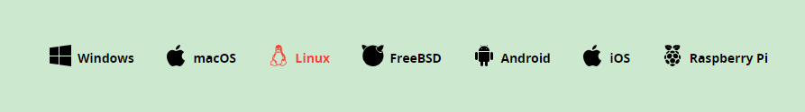
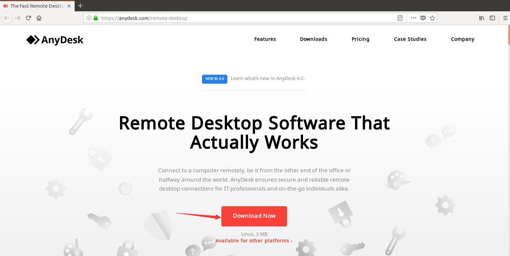
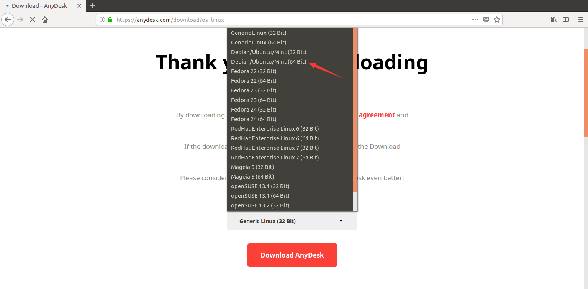
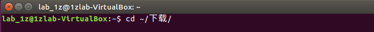
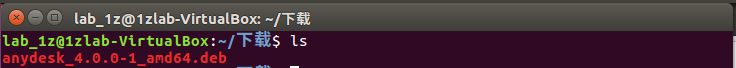
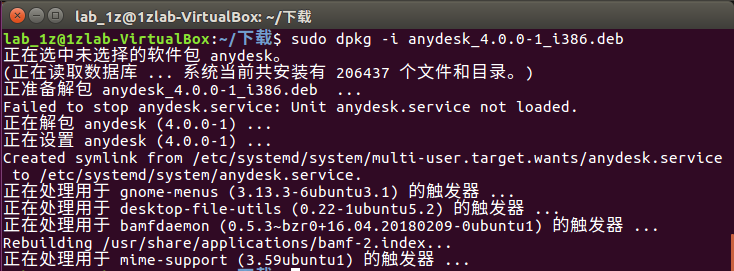
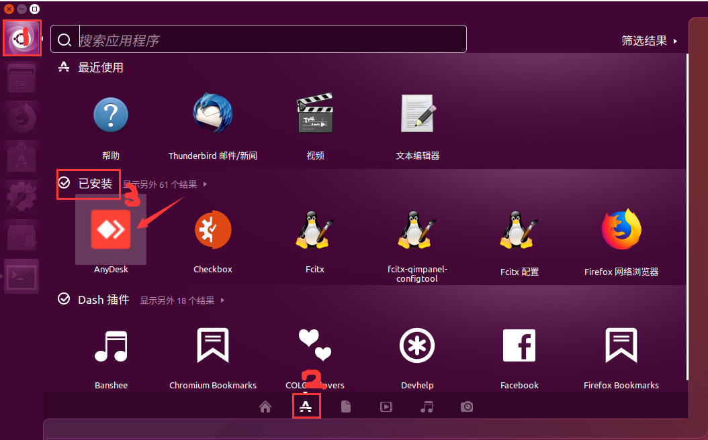
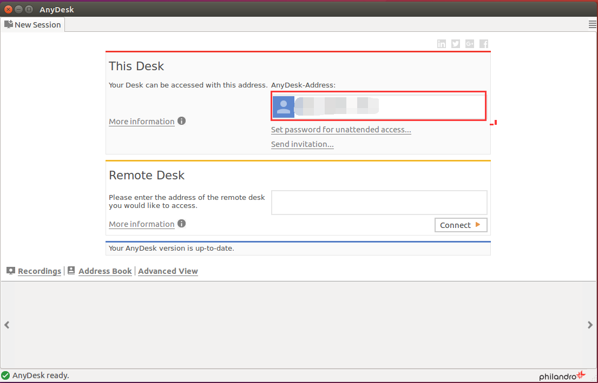

## 概览

本文主要介绍 Ubuntu 下远程协助软件 anydesk 的使用，方便远程定位以及解决问题用以记录。

#### 本文路线：

📗 [anydesk 是什么](#anydesk是什么)

📗 [为什么选 anydesk](#为什么选anydesk)

📗 [anydesk 安装](#anydesk安装过程)

📗 [如何获得协助](#如何获得协助) 👈🏼 如果你只想知道如何获得协助

#### 反馈

📕 或许写的不尽你意，如果关于本文你有什么问题或是什么建议，可以 email to lingxing1017@gmail.com，我们一起探索前行

## anydesk是什么

打开 anydesk 的[官网](https://anydesk.com/remote-desktop)，标签页上写着 "The Fast Remote Desktop Application — Anydesk"（最快的远程桌面应用），快不快先不评价，但是比起 QQ PC 版动辄几十 M 的软件，它的安装包大小可以说是灰常迷你了，才 3.5M（Ubuntu版）

如果你用过 QQ 的远程协助，那你对于它的功能也不会太陌生，不同之处只是它专注于远程协助，而 QQ 只是兼职；如果你用过 teamviewer，那么你基本不需要什么时间成本去学习如何使用它。

## 为什么选anydesk

如上所说，因为它小，除此之外，也因为它全平台支持，不信看下图

## anydesk安装过程

* [下载](https://anydesk.com/platforms/linux) Ubuntu 对应的安装包

    

    

    选择对应的版本，如果你是32位就选上面一项，选完以后点 `Download Anydesk` 即可

    从下载文件列表可以看到，保存到本地的安装包是 deb 格式的，大小 3.5M

* 打开命令行，切换到安装包保存目录，如果你没有选择保存安装包的位置且系安装的时候选择了中文，那么默认就是在 `~/下载/` 下

    此处用到的命令是 `cd`，它是 change directory 的缩写，是用来切换工作目录的

    

    在终端中键入 `ls` 查看当前目录下是否存在我们下载好的anydesk安装包

    此处用到的命令是 `ls`，它是 list 的缩写，是用来显示指定目录下的文件名字的

    

* 最后，安装它

    

## 如何获得协助

安装完后，你可以通过下图方法找到它

点击3，会出现下图

最后只需要将`上图红框中的数字+问题简述` email 给我或者在群中找我约定时间协助就可以了