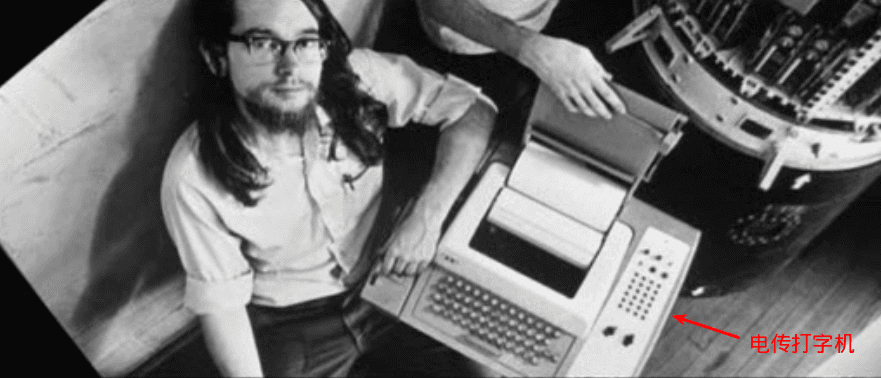
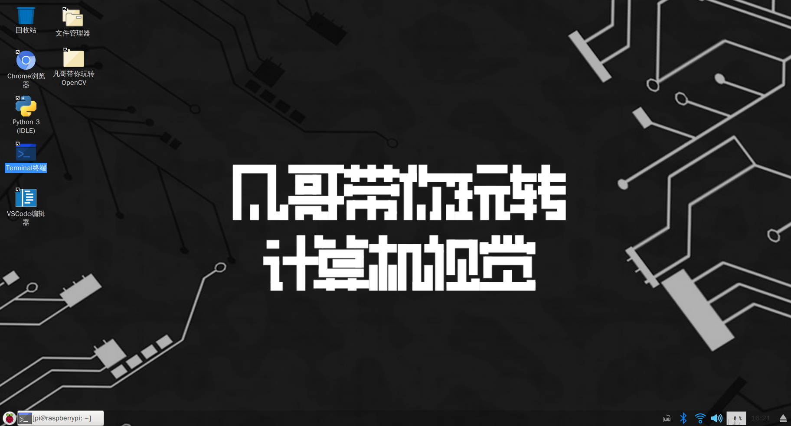
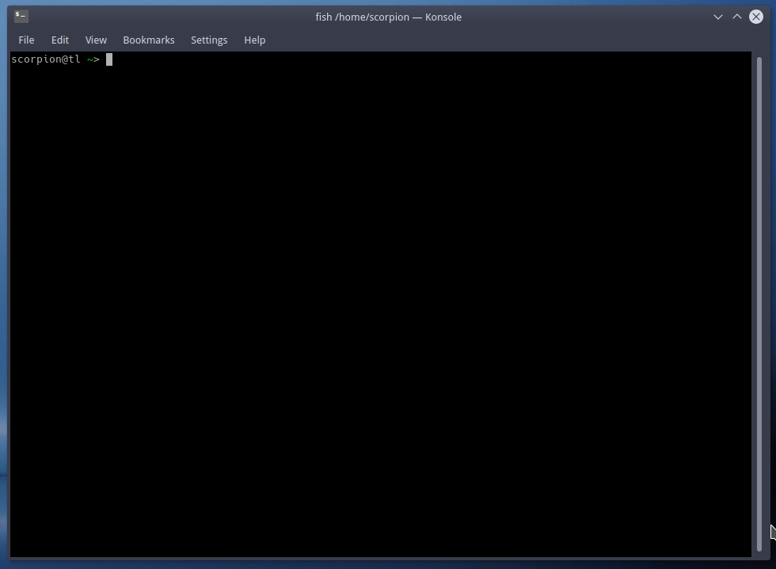
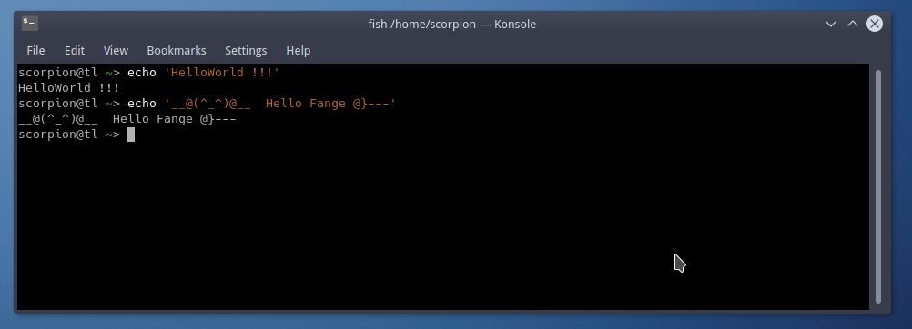
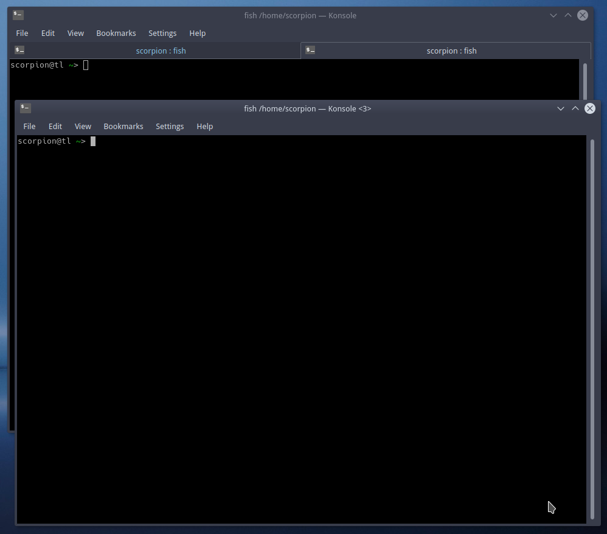
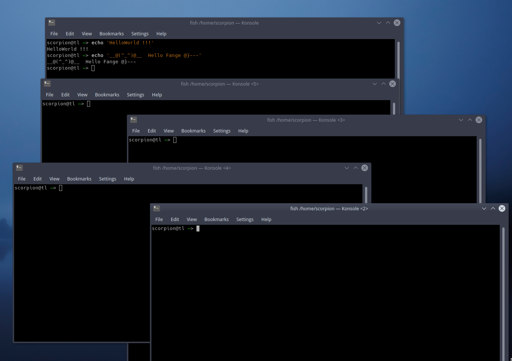
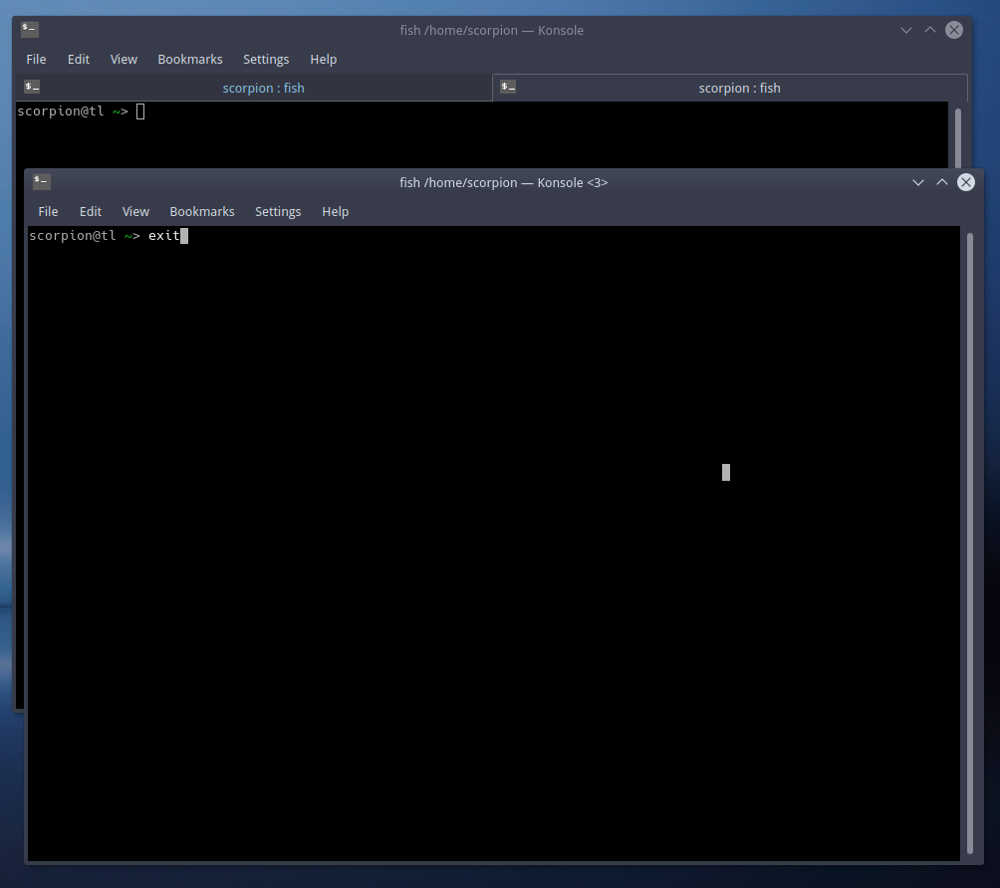
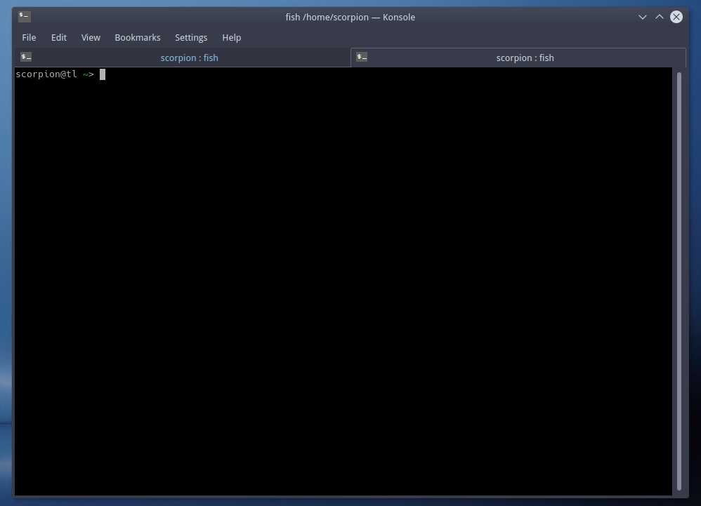

# 初识终端-1Z实验室


## 1. 关于终端Terminal这个名字的由来


下面这段关于终端历史的文字引用自知乎 [Terminal 和 Console 的区别是什么？](https://www.zhihu.com/question/20388511/answer/14984885)

在古老的年代，一个机构可能只有一台主机，而机构的职员使用电传打印机（Teletypewritter 又简称为tty）通过串口连接到主机。后来人们又在电传打印机的基础上进行了改进，程序的输出不再是打印到纸带上而是显示在荧幕上，后来还支持彩色显示，这样的设备后来被称为终端（Terminal）。**一台主机可以有很多个终端**，早期的主机只支持串口线的终端，对应的设备叫做串口终端（Serials Terminal），后来又发展出了伪终端，以便于支持GUI，后来串口终端渐渐被图形界面的伪终端取代，也就是我们今天所说的终端。
**但是在主机的系统启动完成之前，终端是不能连接到主机上的。**为了能记录出主机开机过程的日志，也便于在主机出故障无法启动操作系统时进行检修维护，又多了一个叫做控制台(Console)的设备。**一台主机有且只能有一个控制台。**文件主机的重要日志，比如开机关机的日志和记录，重要应用程序的日志，都会输出到控制台来。


关于终端更详细的历史介绍, 参加下面这篇文章.

[你真的知道什么是终端吗？-Linux大神](https://www.linuxdashen.com/%E4%BD%A0%E7%9C%9F%E7%9A%84%E7%9F%A5%E9%81%93%E4%BB%80%E4%B9%88%E6%98%AF%E7%BB%88%E7%AB%AF%E5%90%97%EF%BC%9F)




## 2. 动手操作


### 2.1 打开一个终端

打开一个终端, 我们可以在桌面/开始菜单, 点击terminal的图标.




为了方便, 我们也可以使用快捷键.

```
CRTL + ALT + T
```




这个就是你通往命令行的大门, 我们所有的指令都是通过terminal与其交互的.


按照程序员世界的惯例, 凡是开头我们都要向世界问好 `HelloWorld`

好, 那么我们使用`echo`指令, 中文的含义是`回声` 就像对着空谷喊话, 过一会儿你就会听到自己的回声.


你给他传入啥 它就在终端打印出来.

我们输入 `echo` + `你想说的话`


```shell
echo 'HelloWorld!!!'
```

按回车(Enter)键, 执行当前指令.




当然我们可以更萌一些

```shell
scorpion@tl ~> echo '__@(^_^)@__  Hello Akai @}---'
__@(^_^)@__  Hello Akai @}---
```


### 2.2 退出当前窗口

如果你继续按`CRTL + ALT + T` 就会打开另外一个`Terminal`





啊啊啊, 快停下, 不要一直摁, 这才教会了你一个快捷键.




然后我们如何关闭这些终端呢?

so, 点击右上角的关闭按钮 小`X`当然是, 可以的.  可是我们如果想达到只用键盘操作, 达到酷炫的新高度, 我们该如何操作呢? 

我们在终端中输入`exit` 指令, 中文就是退出的意思.





然后当前的这个终端就关闭了.


### 2.3 窗口内创建新的一页

很多时候, 我们没有必要重新创建一个窗口, 只需要在当前的窗口创建一个分页,


```
CRTL + SHIFT + T 
```





退出该页(sheet)的方式也是使用`exit`指令, 关闭到最后一个页的时候`exit`退出的就是整个窗口.


### 2.4 在命令行中复制粘贴文本

在终端中的文本操作方式, 跟编辑器中的有些不太一样, 尤其是复制粘贴命令.

大家如果是看着我们的教程, 边看边操作, 其中有些指令要复制粘贴的话, 这里还是要跟大家提及一下

**在终端复制文本**

选中文本, 然后摁组合键

```
CTRL + SHIFT + C 
```

当然也可以在图像化界面的终端中, 右键选择复制.


**在终端粘贴文本**

终端粘贴

```
CTRL + SHIFT + V 
```

当然也可以在图像化界面的终端中, 右键选择粘贴.


大家可以尝试拷贝我们教程中给出的命令行, 例如

```shell
echo 'hello world'
```


`CTRL + C` 复制当前的文本.

然后进入到`终端 Terminal` 中, `CTRL + SHIFT + V` 粘贴我们给出的这个命令行.  如果你的终端中正常粘贴了这段文本, 说明就是ok的.

回车执行命令.


## 3. 总结

本教程, 首先给各位提供了一些`Terminal`相关的演变历史,


接下来, 演示了如何在linux的图形化界面中打开终端.


我们完成了第一个 **HelloWorld** 程序

带大家学习了两个基础的linux指令

- `echo` 回声指令, 在终端打印输入的参数(字符串)
- `exit` 退出当前的Terminal窗口


介绍了图形化界面终端的一些常用的快捷键. 

* 打开终端窗口`CTRL + ALT + T`
* 在窗口中创建一个新页 `CTRL + SHIFT + T` 
* 终端中复制文本 `CTRL + SHIFT + C`
* 终端中粘贴文本 `CTRL + SHFIT + V`


不要害怕, 手把手教学, 多加练习, 你就能掌握这些命令行和快捷键.