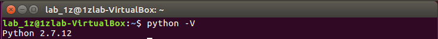
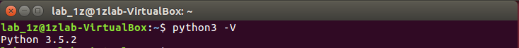
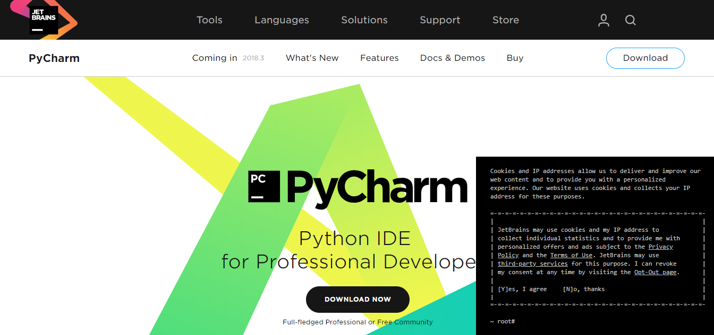
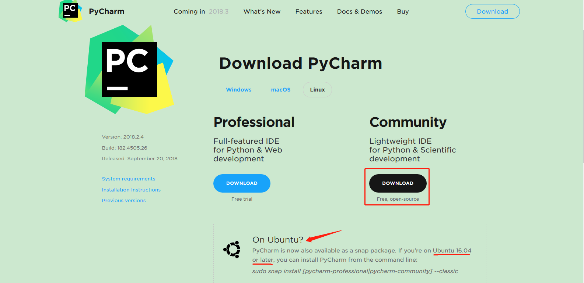
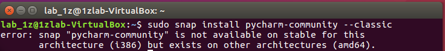
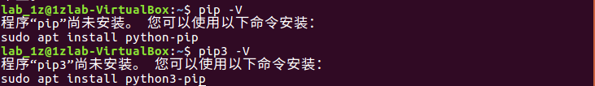
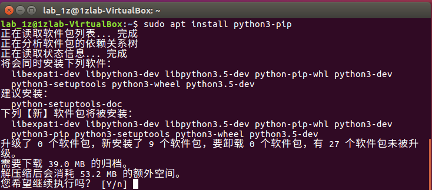
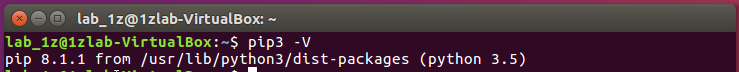

## 概览

本文旨在让你偷瞄 Ubuntu 下的 Python 门缝，以便适应小车教程中 Ubuntu 上的 Python 环境使用

#### 本文路线：

📗 [本机的 Python 环境](#本机的python环境)

📗 [选择开发工具](#python开发工具)

📗 [认识一下 pip](#认识一下pip)

📗 [怎么安装 pip](#怎么安装pip)

📗 [pip 常见操作](#pip常见操作)

📗 [愉快的进入 PyESPCar 吧](#Congratulations)

#### 反馈or求助

📕 或许写的不尽你意，如果你有什么问题或是什么建议，可以 email to lingxing1017@gmail.com 或者[使用 anydesk 请求协助](./00anydesk协助.md)，我们一起探索前行


## 本机的python环境

既然要瞄几眼 py 交易的门缝，那总得知己知己知己（没错全是知己，没有知彼）

先看下本 Ubuntu 的 py 版本吧



怎么是 python2 版本的呢，不是说最新的是 python3 的吗？这个地方就说来话短了，存在即合理，python2 存在这么久，有不少的项目依然依赖 python2 的环境也是正常的，所以 Ubuntu 安装的时候默认是 python2 和 python3 都安装了

那怎么看 python3 的版本号呢？



好奇的话也可以试试下方命令，看看输出什么
```bash
$ python2 -V
```

❓ 那么问题来了，如果本机没有安装 python 环境呢？温故而知新，尝试回顾下之前的再自己解决下吧


## python开发工具

* 选哪个

    俗话说得好，“工欲善其事，必先利其器”，有了环境，只能算是知道了哪扇门，没有一个好的工具，怎么能适当的撬开门缝呢

    此处推荐一款 python 利器，[PyCharm](https://www.jetbrains.com/pycharm/)，至于理由嘛，随便百度一下都说的比我好

    

* 怎么装

    打开[下载](https://www.jetbrains.com/pycharm/download/#section=linux)页面

    

    1. 往常的时候我一定是点击红框的 `Download` 就下载了，不过好像好像有点不对呀，它问我们 `On Ubuntu?` 再看看，Ubuntu 的版本好像也符合，原来在 `Ubuntu 16.04 以及之后的版本`都可以直接通过命令安装，连手动下载都省了

        ```bash
        $ sudo snap install pycharm-community --classic # 作为 Ubuntu 的用户，我们选择安装开源的社区版
        ```
    
        简单提下 `snap` ，它是一种全新的软件包安装管理方式，和 `apt` 不同，使用它安装的应用程序会包含所有需要用到的所有文件和库，从而实现了各个应用程序之间的相互隔离。因此它解决了软件包的依赖问题，也使应用程序更容易管理

        不过，这种方式安装有两个限制，一是下载速度比较慢（理由你懂的），二是对于 32 位的 Ubuntu 它并不支持安装，如果你是 64 位的那么你可以放心安装，下图中的错误就是这个问题

        

    2. 那只好 Download 了，此处由于篇幅原因，提供外部安装教程，[点此查看](https://jingyan.baidu.com/article/60ccbceb4e3b0e64cab19733.html)，如果遇到问题，你可以选择[请求协助](#反馈or求助)


## 认识一下pip

* pip 是什么
    pip 是 Python 包管理工具。提供了对 Python 包的查找、下载、安装、卸载的功能
* 用 pip 安装的“软件”和 Ubuntu 上安装的软件有什么关系
    pip 是 Ubuntu 安装的软件之一，pip 安装的“软件”，准确的说 pip 安装的是 Python 包，两者没有关联，所以不必担心 Ubuntu 安装软件时会影响 pip 安装，反之亦然


## 怎么安装pip

首先看看本机是否已经安装了 pip



可见本机并没有安装任何版本的 pip，由于后续我们主要用到的 pip3，所以我们现在只需要按第二个提示安装即可



输入 y （大小写均可）后回车即可安装完成

再通过查看 pip3 版本来检验一下是否真的安装了，如果出现下图，那么恭喜你，已经完成了 pip3 的安装




## pip常见操作

* 安装新的 python 包
    ```python
    pip install 包名
    ```
* 卸载 python 包
    ```python
    pip uninstall 包名
    ```
* 寻找 python 包
    ```python
    pip search 包名
    ```
* 查看是否安装 python 包
    ```python
    pip show --files 包名
    ```
* 检查哪些包需要更新
    ```python
    pip list --outdated
    ```
* 升级指定包
    ```python
    pip install --upgrade 要升级的包名
    ```

## Congratulations

现在，你可以愉快的进入 PyESPCar 了