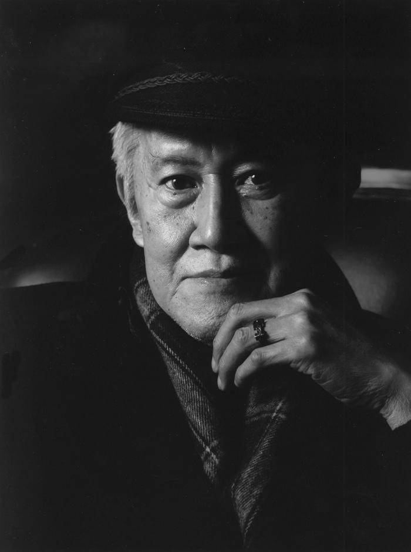
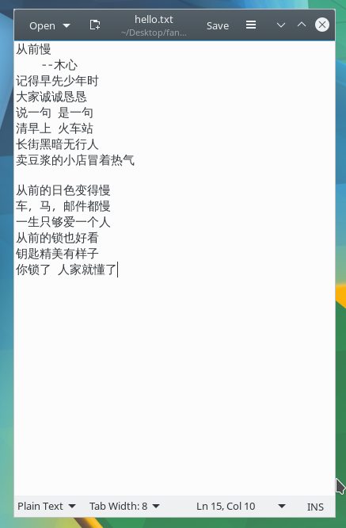
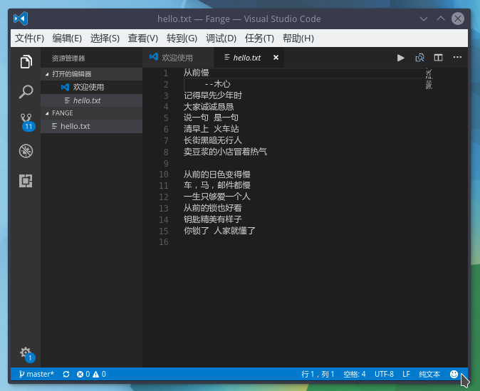

# 文件系统之文件操作02-1Z实验室


## 0.概述

本期将带大家进入Linux文件操作的第二部分.

我会带大家使用命令行做如下操作.

* mkdir 创建文件夹
* touch 创建一个文件
* vim /geidt/vscode 编辑文件
* cat 查看文件
* cp 复制
* mv 移动
* rmdir 删除文件夹
* rm 删除文件/文件夹

实例教学, 跟着教程的操作 ,自己也同时边看边敲命令行.

>这篇文章相比较前几篇文章比较长一些, 希望大家可以耐心看下去.


## 1. mkdir - 创建文件夹

学习了如何进入一个文件夹(cd)与查看文件目录(ls)之后, 接下来我们要尝试创建一个自己的文件夹.
我们暂且称之为`Akai`

这里我们需要一个新的指令叫`mkdir`
英文全称叫做`make directory` 创建一个文件夹/目录

* `mk`: make
* `dir` : directory linux常用于表示文件夹

```bash
mkdir Akai
```

这个时候,我们调用`ls`指令,就可以看到我们新创建一个文件夹.

```bash
scorpion@tl ~/D/fange_opencv_tutorial> ls | grep F
Akai
Feature特征检测
```
因为目录下文件夹太多, 我使用`grep`指令, 去筛选`F`打头的文件夹/文件.

我们在这里先不深入介绍`grep`, 目前只需要知道, 它是用于筛选满足一些特征(例如开头字符, 正则表达式等等)的结果的工具.

好, 看到我们新创建的文件夹之后, 我们进入到里面去.顺便回顾一下我们的`cd`指令.

```bash
scorpion@tl ~/D/fange_opencv_tutorial> cd Akai/
scorpion@tl ~/D/f/Akai> ls
scorpion@tl ~/D/f/Akai> pwd
/home/scorpion/Desktop/fange_opencv_tutorial/Akai
```

我们可以看到文件夹下空空如也.


## 2. touch - 创建一个文件

在linux里面, 如果我们要创建一个空文件, 我们就需要使用 `touch`
`touch`后面加文件名称.

>暂时没有参透它命名英文的简写, 知道的朋友可以给我留言.


```bash
scorpion@tl ~/D/f/Akai> touch hello.txt
scorpion@tl ~/D/f/Akai> ls
hello.txt
scorpion@tl ~/D/f/Akai> 
```
我们可以看到我们在当前`Akai`这个目录下面, 创建了一个名叫`hello.txt`的文本.

实际上`touch`在linux的默认用法是修改当前文件的时间戳`timestamp` 为系统当前的时间, 如果文件不存在的话, 就会被创建一个空文件.
我们这里只涉及它创建一个文件的用法.
```
Update the access and modification times of each FILE to the current time.
```


## 3. gedit - 使用图形化的编辑器

创建了一个文件之后, 我们总想给这个文件里写点啥, 例如想留言一首木心先生的温暖的小诗.




```bash
从前慢
    --木心
记得早先少年时 
大家诚诚恳恳 
说一句 是一句 
清早上 火车站 
长街黑暗无行人 
卖豆浆的小店冒着热气 
  
从前的日色变得慢 
车，马，邮件都慢 
一生只够爱一个人 
从前的锁也好看 
钥匙精美有样子 
你锁了 人家就懂了
```

你可以使用命令行版本的编辑器`vim`, 但是为了不给自己入手添加太多的阻碍, 建议先对基础的命令行熟悉之后, 再继续深入学习其他的工具或者编辑器.

我们还是朴实一点, 用图形化的编辑器

```
gedit hello.txt
```

运行图形化界面, 填入我们的文字.



`CTRL + S`保存我们写的这段优美的文字.


## 4. vscode 一款更好用的编辑器

使用我们`XCore`开发板的用户, 我们为大家预装了`vscode`. 大家运行`code`指令打开单个文件, 或者打开整个工程目录.

打开当前的文件夹
```bash
code .
```
传入完整路径,打开文件夹工程
```bash
code /home/scorpion/Desktop/fange_opencv_tutorial/Akai
```
还可以只打开这个文件
```bash
code hello.txt
```



这个图形化编辑器的更多功能还等大家自己去探索.


## 5. cat - 在终端预览文件内容.


`cat` 这个指令, 它取一个或多个文本文件的名称，然后将其内容作为一个数据流显示到标准输出。

```
 concatenate files and print on the standard output
```

例如我们可以执行下面这条指令, 让文件中的内容打印到终端上面

```bash
cat hello.txt
```


```bash
scorpion@tl ~/D/f/Akai> cat hello.txt 
从前慢
    --木心
记得早先少年时 
大家诚诚恳恳 
说一句 是一句 
清早上 火车站 
长街黑暗无行人 
卖豆浆的小店冒着热气 
  
从前的日色变得慢 
车，马，邮件都慢 
一生只够爱一个人 
从前的锁也好看 
钥匙精美有样子 
你锁了 人家就懂了

```

实际上我日常使用的时候, 会加一个箭头的符号`>` , `<`. 它代表数据流的方向.

```
cat < hello.txt
```
这条语句跟上面的语句功能上是一样的.
箭头`<` 代表数据流向是终端. `>`代表数据流向是文件.
也就是说我们执行linux指令,或者在终端运行某个软件, 输出的字符信息或者我们称之为日志信息都可以导入到文件中.

还记得我们之前提到过的`echo` 指令么. 

```bash
echo 'MrFange'
```
`echo`语句会导出一个数据流, 我们将其存到一个文件中, 这里我们导入到一个名字叫做`Akai-echo.txt`的文件中. 注意,文件不必提前创建`touch`, 它会自动生成.

```bash
scorpion@tl ~/D/f/Akai> echo 'MrFange' > Akai-echo.txt
scorpion@tl ~/D/f/Akai> ls
Akai-echo.txt  hello.txt
scorpion@tl ~/D/f/Akai> cat Akai-echo.txt 
MrFange
```

再列举一个例子, 我们在当前目录下执行ls语句, 并将其结果输出到`ls-record.txt`的文件中.

```bash
scorpion@tl ~/D/f/Akai> ls > ls-record.txt
scorpion@tl ~/D/f/Akai> cat < ls-record.txt 
Akai-echo.txt
hello.txt
ls-record.txt
```


## 6. cp - 拷贝文件/文件夹


接下来, 我们要将之前写有小诗的`hello.txt`复制一份另存为`poem.txt`
这里我们需要`cp`指令, 英文全称是`copy`是复制的意思.


```bash
scorpion@tl ~/D/f/Akai> cp hello.txt poem.txt
scorpion@tl ~/D/f/Akai> cat < poem.txt 
从前慢
    --木心
记得早先少年时 
大家诚诚恳恳 
说一句 是一句 
清早上 火车站 
长街黑暗无行人 
卖豆浆的小店冒着热气 
  
从前的日色变得慢 
车，马，邮件都慢 
一生只够爱一个人 
从前的锁也好看 
钥匙精美有样子 
你锁了 人家就懂了
```
就这样文件就被复制了.

我们掌握了复制的技能, 那我们可不可以复制整个文件夹呢, 我们试一下.

我们需要退回到上层目录.
```bash
cd ..
```

```bash
scorpion@tl ~/D/fange_opencv_tutorial> cp Akai/ Akai-Copy
cp: -r not specified; omitting directory 'Akai/'
```

尴尬, 它提示有错误了, 说我们没有指定拷贝对象.

这里我们就需要`cp`指定其中一个参数

```bash
-R, -r, --recursive
copy directories recursively
```
`递归`的方法是拷贝文件夹. 没接触过算法的同学, 可能对`递归`比较陌生.
这个时候, 你可能需要去百度一下, 或者搜索一下汉娜塔问题.

简单来讲, 就是我先复制这个文件夹, 然后文件夹内的内容继续拷贝.

```bash
scorpion@tl ~/D/fange_opencv_tutorial> cp -r Akai/ Akai-Copy
```

展示一下结果
```bash
scorpion@tl ~/D/fange_opencv_tutorial> ls | grep Akai
Akai
Akai-Copy

scorpion@tl ~/D/fange_opencv_tutorial> cd Akai-Copy/
scorpion@tl ~/D/f/Akai-Copy> tree
.
├── Akai-echo.txt
├── hello.txt
├── ls-record.txt
└── poem.txt

0 directories, 4 files

```

我们退回原来的文件夹.


## 7. mv 移动/重命名

我们可以使用`mv` (英文是 `move`)指令来移动文件夹的位置或者将其重命名(在同一目录就相当于重命名了)

例如我们之前创建的那个`hello.txt`, 现在我想将其重命名为`cong-qian-man.txt`.

```bash
scorpion@tl ~/D/f/Akai> mv hello.txt cong-qian-man.txt
scorpion@tl ~/D/f/Akai> ls
cong-qian-man.txt  Akai-echo.txt  ls-record.txt  poem.txt
```

我们可以将这个文件移动到别的地方去, 例如移动到我们之前创建的`Akai-Copy`文件夹内.

```bash
scorpion@tl ~/D/f/Akai> mv cong-qian-man.txt ../Akai-Copy/
scorpion@tl ~/D/f/Akai> cd ../Akai-Copy/
scorpion@tl ~/D/f/Akai-Copy> tree
.
├── cong-qian-man.txt
├── Akai-echo.txt
├── hello.txt
├── ls-record.txt
└── poem.txt

0 directories, 5 files

```

> PS: 为啥很唠叨的去做这么多演示示例, 从的教学理念来讲, 输入决定产出, 你只有看别人的操作样例多了之后, 你才能熟练掌握这里指令的使用. 多练之前一定要多看. 切记.

我们可以看到`cong-qian-man.txt` 已经成功地放置在`Akai-Copy`这个文件夹内了.

那接下来要给大家演示一下, 如何移动/重命名文件夹.

`mv`指令, 第一个传入的是源文件夹, 第二个参数是目的文件夹.

如果`Akai-Copy2`这个文件夹不存在, 这个语句就相当于`rename 重命名`

如果`Akai-Copy2`这个文件夹存在,提前创建好. 那么这句指令的意思就变成了, 将`Akai-Copy`这个文件夹, 移动到`Akai-Copy2`这个目录下. 也就是`Akai-Copy2`包含`Akai-Copy`这个目录.
大家可以自行实验一下.


```bash
mv Akai-Copy/ Akai-Copy2/
```

```bash
scorpion@tl ~/D/fange_opencv_tutorial> pwd
/home/scorpion/Desktop/fange_opencv_tutorial
scorpion@tl ~/D/fange_opencv_tutorial> mv Akai-Copy/ Akai-Copy2/
scorpion@tl ~/D/fange_opencv_tutorial> ls | grep Akai
Akai
Akai-Copy2
```

```bash
scorpion@tl ~/D/fange_opencv_tutorial> cd Akai-Copy2/
scorpion@tl ~/D/f/Akai-Copy2> tree
.
├── cong-qian-man.txt
├── Akai-echo.txt
├── hello.txt
├── ls-record.txt
└── poem.txt

0 directories, 5 files

```


## 8. rm - 删除文件/目录


分别总是难免的, 有些文件创建出来就是为了被删除的, 因为它的效能已经发挥完毕.


`rm`是`remove`的缩写是删除的意思. `rm`后面紧跟文件名, 就是删除这个文件.


```bash
scorpion@tl ~/D/f/Akai-Copy2> ls
cong-qian-man.txt  Akai-echo.txt  hello.txt  ls-record.txt  poem.txt
scorpion@tl ~/D/f/Akai-Copy2> rm hello.txt 
scorpion@tl ~/D/f/Akai-Copy2> rm ls-record.txt poem.txt 
scorpion@tl ~/D/f/Akai-Copy2> ls
cong-qian-man.txt  Akai-echo.txt

```

需要提的是, 你可以给`rm`传入多个参数, 很多指令都支持传入多个参数. 可以同时删除多个文件.

当然最有效的方式, 我们还是删除整个文件夹.

如果你的文件夹是空文件夹的话, 你可以使用`rmdir`指令(Remove Directory) 删除文件夹.
```bash
scorpion@tl ~/D/f/Akai-Copy2> ls
cong-qian-man.txt  Akai-echo.txt

#创建文件夹 tmp
scorpion@tl ~/D/f/Akai-Copy2> mkdir Tmp

scorpion@tl ~/D/f/Akai-Copy2> ls
Tmp/  cong-qian-man.txt  Akai-echo.txt

# 删除空文件夹
scorpion@tl ~/D/f/Akai-Copy2> rmdir Tmp/
scorpion@tl ~/D/f/Akai-Copy2> ls
cong-qian-man.txt  Akai-echo.txt

```

但是, 如果你的文件夹非空, 使用设个指令就会出错

```bash
scorpion@tl ~/D/fange_opencv_tutorial> rmdir Akai-Copy2/
rmdir: failed to remove 'Akai-Copy2/': Directory not empty
```
报错说: 文件夹非空, 文件删除失败.

我们只能借助`rm`指令, 需要填入一个选项`-r`递归操作. 这样我们就成功删除了整个`Akai-Copy2`文件夹里面的内容及其本身.

```bash
scorpion@tl ~/D/fange_opencv_tutorial> rm -r Akai-Copy2/
scorpion@tl ~/D/fange_opencv_tutorial> ls | grep Akai
Akai
```

江湖上流传, 有一个必杀的指令叫


```bash
sudo rm -fr /
```
自己千万别运行!!!!!

`sudo` 是以管理员权限运行该指令.
之前提到过`/`指的是根目录. `rm`删除 `-r`代表递归, `-f` force代表强制.

具体会发生什么, 大家可以脑补一下.

其实目前很多`linux`的发行版, 例如`Ubuntu`是受到保护的, 默认这样做是被拦截的, 除非添加一些其他选项.

如果大家感兴趣, 可以参照知乎的这篇文章

[在现代的Unix操作系统上执行sudo rm -rf /会发生什么？](https://www.zhihu.com/question/21682570)

https://www.zhihu.com/question/21682570


## 9. Summary小结

本次带大家完成了linux使用命令行进行文件操作, 基本上已经覆盖了常见的需求.
简单总结一下.

我们学习了:

### mkdir-创建文件夹

```bash
mkdir + 文件名称
```

### touch-创建文件

```bash
touch + 文件名
```

### 编辑器的使用

这里主要介绍了`gedit`跟`vscode`从命令行的启动方法.

**gedit**
```bash
gedit + 文件名
```
**vscode**

```bash
code + 文件名
code + 文件夹路径
```
### cat 文件流的输出

```bash
# 将文件中的内容, 打印到终端
cat + 文件名
cat < 文件名

# 将数据存放在文件中
cat > 文件名
```

### cp 复制

复制文件
```bash
cp + 源文件名/路径 + 目的文件名/路径
```
复制文件夹
`-r`表示递归

```bash
cp -r 源文件夹名/路径 + 目的文件夹名/路径
```

### mv - 移动位置

移动/重命名文件

```bash
mv + 源文件 + 目的文件
```
移动/重命名文件夹
```bash
# 删除空文件夹
rmdir + 文件夹名称

# 删除非空文件夹
rm -r + 文件夹名称/路径
```

