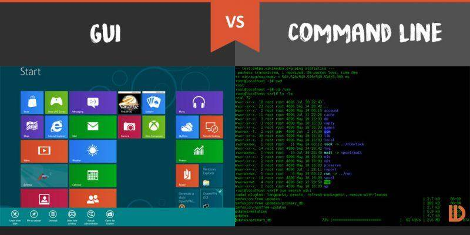

# 为什么要学习命令行-1Z实验室

##0. 概述

本教程是Linux基础入门的开篇文章.
将会带大家了解`GUI` 跟 `CLI`之间的不同, 并且分析为什么大家需要学习linux命令行.
以便给大家学习的动力.

## 1. 人跟计算机是如何沟通的

最开始，计算机刚被发明的时候， 人与计算机之间的交互是依赖小纸带打孔的。
后面，出现了命令行界面`CLI : Cammand Line Interface`, 计算机被专业的程序员所使用。
后来出现了图形化界面，`GUI ：Graph User Interface`， 人可以用鼠标点点，就可以跟计算机交互， 大大降低了使用计算机的门槛。
由此， 计算机变得普及。

## 2. 为什么我们需要学习命令行

我们在使用windows的时候， 可能会感觉图形化界面挺好， 各种功能的IDE也很好用， 那么我们为什么要退化去学习命令行呢？
这里给你列举几个理由。

**命令行有时候是唯一的选择**
我们在运行物联网设备或者是远程链接服务器的时候， 本来就没有图形化界面供我们使用，如果想远程控制计算机， 
就必须通过`ssh`或者其他方式， 链接其终端，输入指令。

**图形化界面开销大**
有些低配的卡片电脑运行图形化界面会很卡，占用很多的系统资源， 有时候还得需要显卡支持。
运行CLI， 可以让系统资源释放给它更应该做的事情。

**命令行更高效**
这句话是给熟练掌握命令行编程的人讲的。
我说命令行更高效主要基于两个方面：
一个是`有些时候`， **键盘操作速度要比鼠标快**， 使用鼠标+键盘在二者切换的过程中就会花费很多时间。
注意我这里说的是有些时候，如果图像处理ps或者画图的话，当然是图形化界面更快。不要抬杠也不能教条。 

第二是**图形化界面不可重复**， 除了excel中录制宏的少数特例以外， 我们大多数的图形化操作， 每一次操作都需要我们鼠标一个个点过去。
而命令行就不同， 我们可以编写一系列的脚本（例如写在.sh脚本 或者python脚本）， **一键完成所有过程**

但需要承认的是， 一开始上手linux， 各种命令语句会让人发狂。

而且根本记不住，写一句查一句根本就没有效率可言. 后来我才发现， 其实**命令行不是背出来的而是用出来的**。 我们只需要掌握少数常用的功能。

剩下的我们可以查系统文档， 查自己的笔记 别人的博客。

## 3. 拓展阅读

[GUI vs. Command Line: What's the Difference?](https://www.difference.wiki/gui-vs-command-line/)

