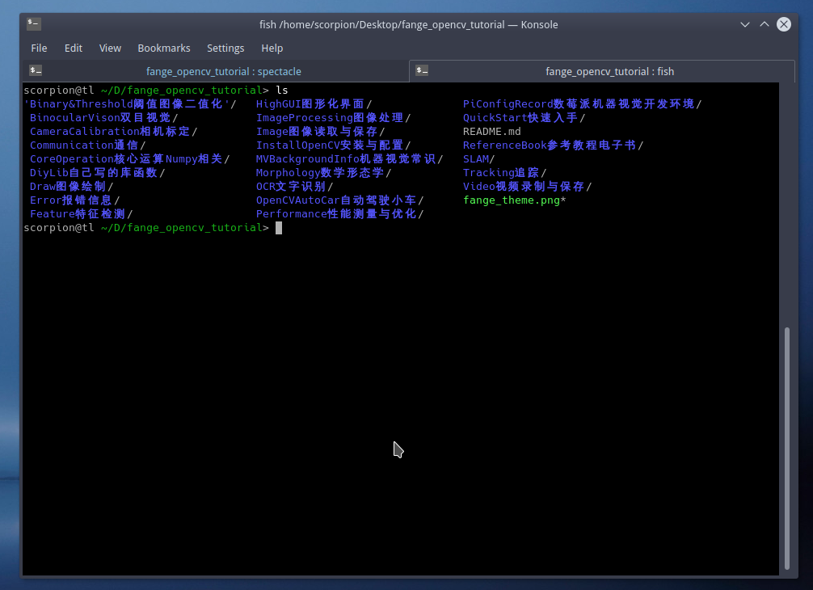
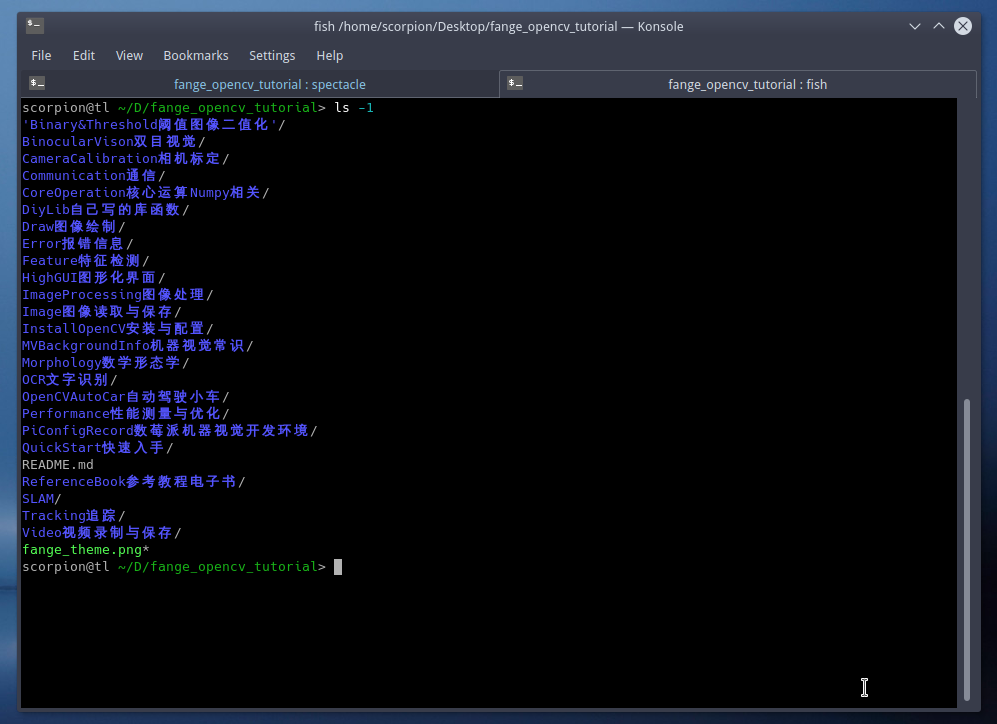
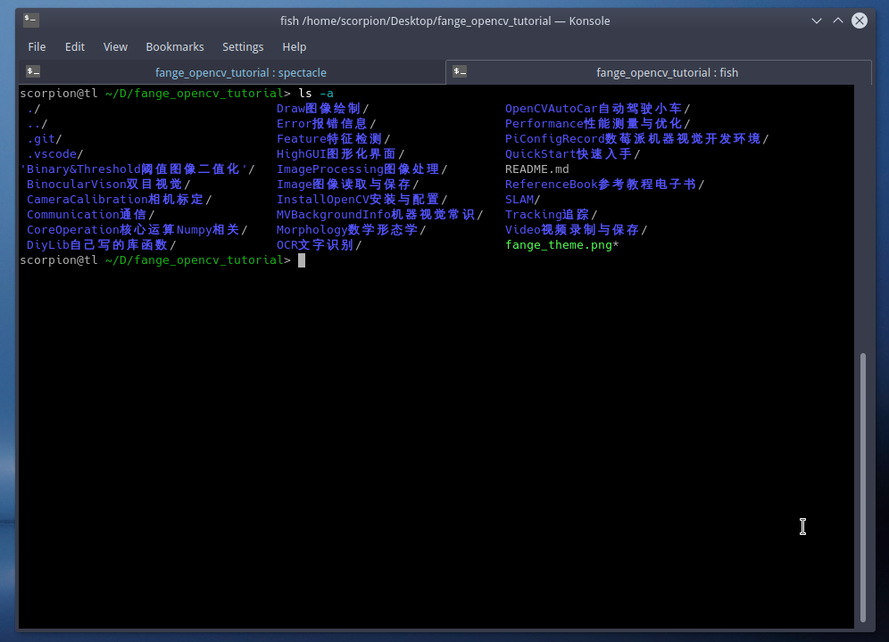

# 文件系统之文件操作01-1Z实验室


## 0. 概要

我们平常在使用文件系统的过程中, 常见的也无非就是文件/文件夹的增删改查.
这次课程主要给大家讲解一下文件列表与进入文件夹这两个操作.


## 1. pwd - 定位当前位置


如何查看我们当前所处文件系统的位置呢?
这个时候我们就需要`pwd` 

老规矩,记住一个指令最好的方法是, 了解它的英文全称.
`pwd` 的英文全称为
```
pwd outputs (prints) the current working directory.
```
* **P** : Print 打印
* **W** : Working 工作(当前)
* **D** : Directory(路径)

我们实验一下

```bash
scorpion@tl ~> pwd
/home/scorpion
```
默认`Terminal`打开之后, 进入的路径是Linux当前用户的主目录.
其中所有的用户目录都在linux系统的`home`路径下, 用户目录以用户的用户名命名. 个人的文件都会放在`/home/用户名` 这个目录下.

如果你在使用的是树莓派, 你返回的就是
```bash
pi@tl ~> pwd
/home/pi
```


## 2. ls - 查看文件列表

### 2.1 基础款ls
好的, 目前我们已经知道当前自己所处的路径了, 那如何才能知道当前的路径都有哪些内容呢?
这里我们就需要用到一个指令 `ls`

`ls` 的功能英文介绍:

```
list directory contents
```
列举一下当前路径的内容 **l**i**s**t

我们验证一下这个指令.



这个是**带你玩转OpenCV**的主目录的文件列表.可以看到文件夹跟文件会用不同的色彩**高亮**, **加粗**.

>PS 抱歉我已经偷偷地切换了目录. 后面再讲如何切换. 你执行`ls`得到的应该是你主用户目录里的文件夹列表.

实际上我们可以给`ls`传入各种参数, 达到花式列表的效果.

### 2.2 竖排显示

我们会发现之前的文件排版的横向对齐, 如果我们想让所有的文件文件夹都显示在一列, 这个时候, 我们就可以执行命令:

```
ls -1
```

这是我们目前为止接触的第一个需要传入参数的指令, 空格然后`-`横杠加上数字`1`.
`-`跟`--` 一般用作传参的标志, 
`1` 是其中的一个选项代表竖排显示.

linux里面的参数命名, 肯定是有其意义的. 我们查看一下文档, 可以看到它的定义.

> 后面会教大家如何查看linux的手册与手册结构解析, manual手册肯定是要的, 没有谁可以记住所有的指令.

截取部分文档说明
```
List  information  about  the  FILEs (the current directory by default).
翻译: 列举当前目录的文件信息

-1     list one file per line.  Avoid '\n' with -q or -b
翻译:　每行显示一个文件／文件夹的名称．
```

看来这里的`1`表示一行只显示１个的意思．读到这里相信大家可能会对linux中的命名方式的简约所折服. 对于程序员来讲, 学习linux的设计对提高自身水平有非常好的帮助.

我们来看一下效果.




### 2.3 显示隐藏的文件夹

我们首先执行一下这个指令. (还是`ls`指令, 不过换了一个参数.)

```
ls -a
```
我们来看一下文档中的介绍

```
-a, --all
        do not ignore entries starting with .
```
翻译: 不忽略以`.`的文件入口
`a` : `all` 是全部的意思, 是不是非常好记. 要提醒各位小伙伴的是, linux指令不要死记硬背, 一定要琢磨一下命名后面的真实含义.


同时需要大家注意的是, 这里有两个选项`-a`, `--all`.

`-a`是`--all`选项的简写形式

这两个指令是一样的.
```
ls --all
ls -a
```

效果如下


可以看到的是, 这里我们执行`ls`指令, 多出来一些文件/文件夹.
这个参数的意思是显示所有的文件(包括隐藏的文件)

在linux操作系统中, 隐藏的文件都以`.`开头. 这样在平常的文件列表中, 我们就看不到这个文件.
例如`.git`文件夹存放的是`fange_opencv_tutorial`这个工程的git历史记录.
`.vscode`存放的是我们使用VSCode编辑器编辑这个工程的时候, 产生的一些临时文件.


**!!!敲黑板, 重点来了!!!**

刚才执行`ls -a`还有两个特殊的隐藏文件夹

* **.** 表示当前路径
* **..** 表示父级目录 也就是当前目录的上一级.

这两个隐藏文件夹在每个文件里都有, 这个是Linux文件系统中的规定. 对于我们的访问操作带来了很多方便的地方.


好,对于`ls`的介绍就告一段落, 虽然特别想演示一下这些功能
* 根据开头筛选目录列表
* 根据正则表达式筛选文件
* 展示更多的文件信息 例如 创建者 文件大小 权限等等

不过, 超纲了 ,我们一点点来.


## 3. cd - 打开进入文件目录


### 3.1 长驱直入

`cd`是一个神奇的指令, 它可以让我们自由的在文件系统中穿行, 它就是哆啦A梦中的任意门, 带你去你想去的任何地方.


之前还没给大家演示, 如何从用户主目录, 达到写的教程的工程目录下的.

我们回退到主目录, 重新演示一下.
这是我们的主目录
```bash
scorpion@tl ~> pwd
/home/scorpion
scorpion@tl ~> ls
 CLionProjects/   LangExpr/   Pictures/   VirtualBox VMs/   nvvp_workspace/
 Desktop/         Movie/      Projects/   YunJiang/          package-lock.json
 DockerSoft/      Music/      Software/   cuda-workspace/    processing/
 Documents/       Notebook/   Vedio/      metastore_db/      server_info.md
 Downloads/       OS/         Videos/     node_modules/      sketchbook/

```

我们的工程存放在`/home/scorpion/Desktop/fange_opencv_tutorial/` 这个路径下.


我们可以直接

```bash
cd + 文件目录
```
例如

```bash
scorpion@tl ~> cd /home/scorpion/Desktop/fange_opencv_tutorial/
scorpion@tl ~/D/fange_opencv_tutorial> pwd
/home/scorpion/Desktop/fange_opencv_tutorial
```

我们也可以传入相对路径
```bash
scorpion@tl ~> cd Desktop/fange_opencv_tutorial/
scorpion@tl ~/D/fange_opencv_tutorial> pwd
/home/scorpion/Desktop/fange_opencv_tutorial
```
也可以一层一层地进入．

```bash
scorpion@tl ~> cd Desktop/
scorpion@tl ~/Desktop> cd fange_opencv_tutorial/
scorpion@tl ~/D/fange_opencv_tutorial> pwd
/home/scorpion/Desktop/fange_opencv_tutorial
```


### 3.2 路径回退

**我们如何回退到用户主目录呢？**

我们之前介绍过了两个特殊的文件夹`.`跟`..`

我们尝试一下当前目录`.`，我们可以直接用`cd`打开, 不过不会有什么变化．

```bash
scorpion@tl ~/D/fange_opencv_tutorial> pwd
/home/scorpion/Desktop/fange_opencv_tutorial
scorpion@tl ~/D/fange_opencv_tutorial> cd .
scorpion@tl ~/D/fange_opencv_tutorial> pwd
/home/scorpion/Desktop/fange_opencv_tutorial
```

接下来我们试一下`..` 退回到用户主目录.

```python
scorpion@tl ~/D/fange_opencv_tutorial> pwd
/home/scorpion/Desktop/fange_opencv_tutorial
scorpion@tl ~/D/fange_opencv_tutorial> cd ..
scorpion@tl ~/Desktop> pwd
/home/scorpion/Desktop
scorpion@tl ~/Desktop> cd ..
scorpion@tl ~> pwd
/home/scorpion
scorpion@tl ~> 
```


### 3.3 进入用户主目录

嘿嘿，其实还有两个更快捷的方法. 一种是`cd`**后面不加任何参数**．
```bash
scorpion@tl ~/D/fange_opencv_tutorial> pwd
/home/scorpion/Desktop/fange_opencv_tutorial
scorpion@tl ~/D/fange_opencv_tutorial> cd
scorpion@tl ~> pwd
/home/scorpion
scorpion@tl ~> 
```
另外一种是使用**标识符**`~`
讲解这个之前，我们先看一下，一段已经出现无数次的字符串.

```bash
scorpion@tl ~> 
```
觉得有必要给大家解释一下．
* `scorpion`: 当前用户的用户名，这个是的英文名字，幻想可以组建美剧天蝎计划中超级团队．
* `@` : 分割符
* `tl` : 给电脑起的主机名称，tl取自图灵机的英文简写．
* `~` : **重点来了** 这个是用户主目录的意思

我们退回到用户主目录也可以这样
```bash
scorpion@tl ~/D/fange_opencv_tutorial> pwd
/home/scorpion/Desktop/fange_opencv_tutorial
scorpion@tl ~/D/fange_opencv_tutorial> cd ~
scorpion@tl ~> pwd
/home/scorpion
```

同样, 我们也可以使用`~`+用户主目录相对路径进入的工程目录
```bash
scorpion@tl ~> pwd
/home/scorpion
scorpion@tl ~> cd ~/Desktop/fange_opencv_tutorial/
scorpion@tl ~/D/fange_opencv_tutorial> pwd
/home/scorpion/Desktop/fange_opencv_tutorial
```


### 3.4 系统根目录

还有另外一个特殊的标识符是`/`, 代表操作系统的**根目录**.
进入linux系统的根目录 使用命令行

```bash
scorpion@tl ~> pwd
/home/scorpion
scorpion@tl ~> cd /
scorpion@tl /> ls -1
bin@
boot/
dev/
etc/
home/
lib@
lib64@
lost+found/
mnt/
opt/
proc/
root/
run/
sbin@
srv/
sys/
tmp/
usr/
var/
```

决定暂时不给大家介绍linux的文件系统结构即每个文件夹是做什么的, 都放了哪些东西.
后续课程会给大家介绍.


## 4. 课程小结

本次课程, 主要带大家学习了三个linux的文件夹操作指令

* pwd 打印当前位置
* ls 文件列表
* cd 打开文件夹

其中还介绍了**ls**的其中两个操作

* `ls -1` 文件目录打印一列 
* `ls -a` 显示所有的文件, 包括隐藏文件

linux中隐藏文件以`.`开头

然后介绍了几个特殊的**文件路径**

* `/` 操作系统根目录
* `~` 用户主目录
* `.` 当前文件夹
* `..` 父级文件夹

恭喜你, 看完本此课程之后, 你又学习了三个`linux`命令行.