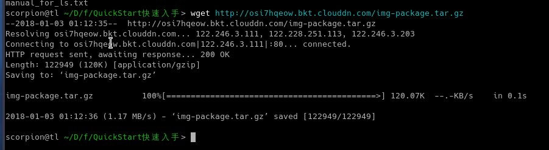
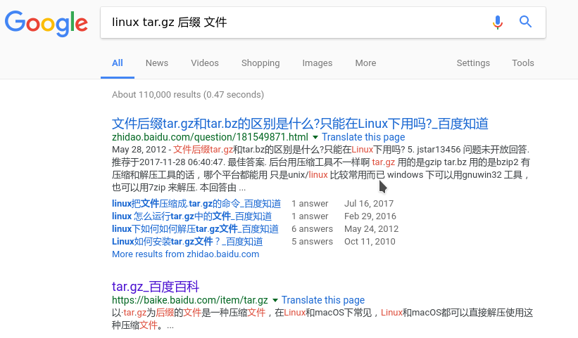
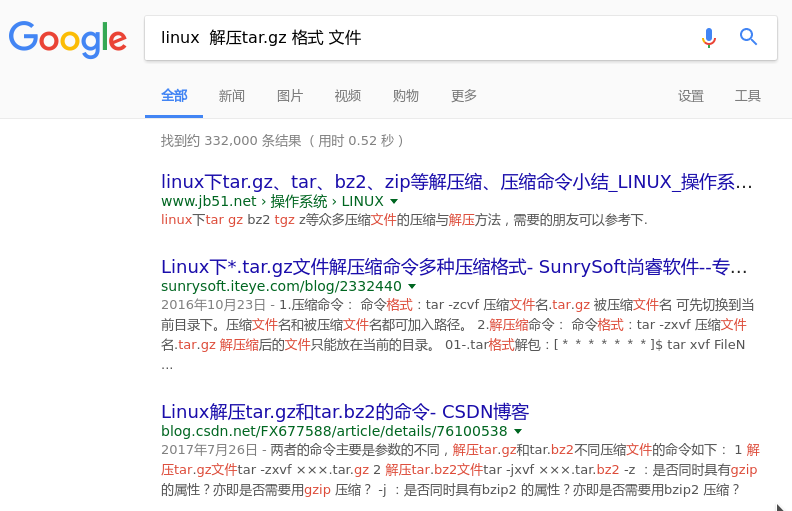
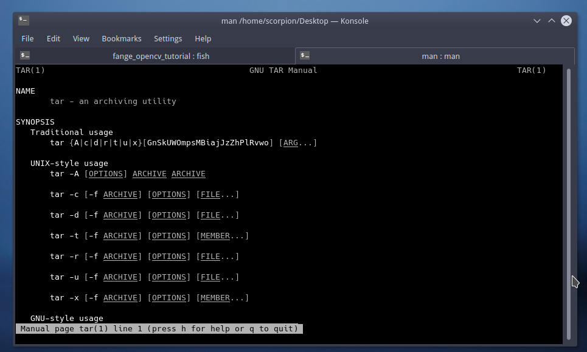
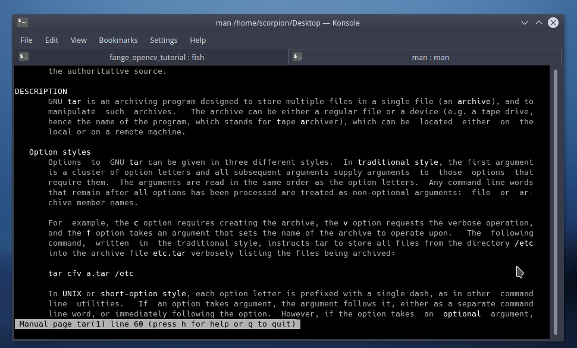
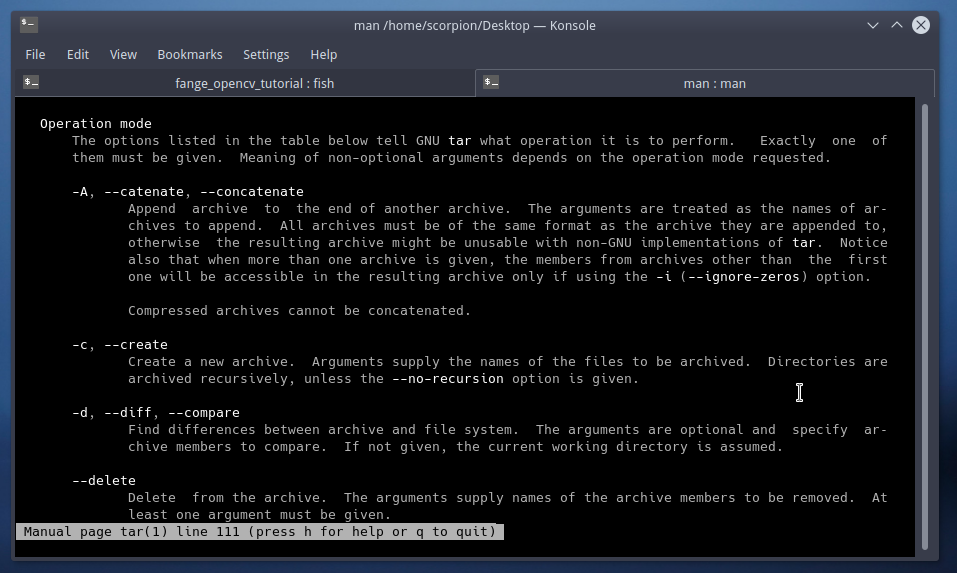
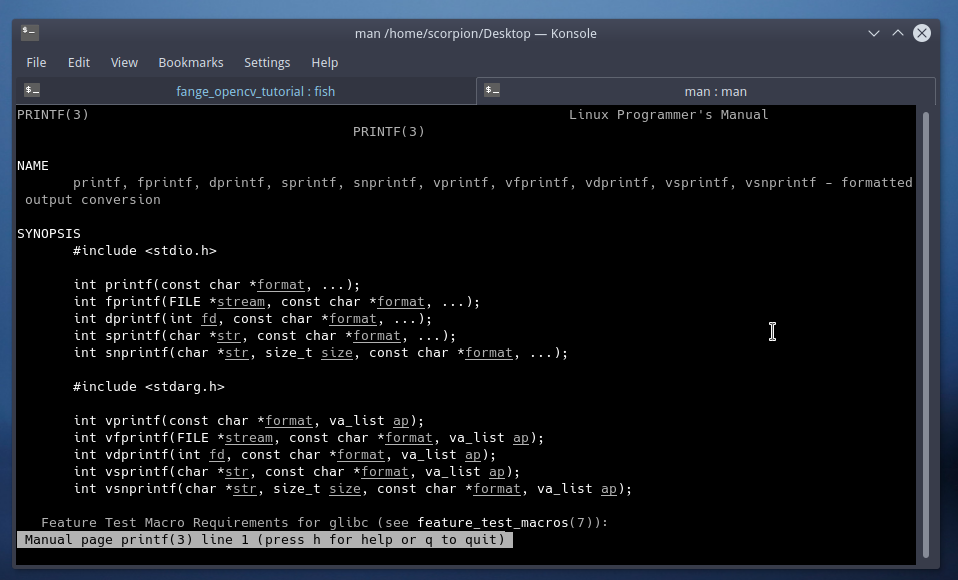
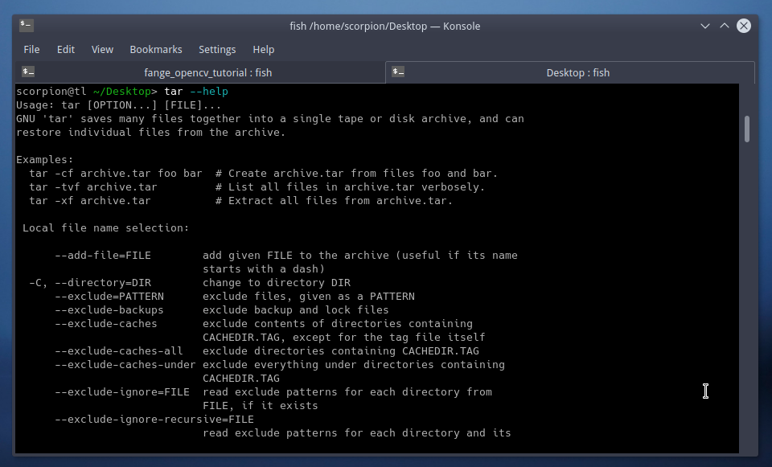

# 如何查询指令的使用手册-1Z实验室

## 0. 概要

本期通过一个解压`tar.gz`文件的需求, 给大家展示了, 如何查询指令, 如何查询指令方法的过程.
过程如下
* 借助搜索引擎, 查找实现需求的相关指令
* 借助`man` `--help`去查看指令的帮助文档, 了解每个选项的含义及使用发法.

另外也给大家推荐了另外一个查询工具`cheat` 简单易用.
当然大家也可以使用纸质的`cheatsheet`, 贴在桌子边上, 以便及时查阅.

## 1. 导言

linux中命令行实在太多了, 实际上即便使用了三年左右的linux, 所会的linux指令跟linux底层的知识, 也只知皮毛. (日常使用是够用的). 如果我每个指令都去讲一下, 不知道啥时候这系列教程才能写完.想做的是教你`万人敌`, `授人以道`, 告诉你命令行如何查阅, 如何整理自己的知识结构, 以便你可以做到快速提升. 


举例来讲, ls指令可能就有几十种用法, 我们不可能去全部记忆. 本身我的记性也不太好, 更不愿意去记住那么多命令行. 那我们如何解决这个问题呢? 这里就要教大家如何搜索指令, 如何查阅手册.


## 2. 先丢给你一个文件

丢给你一个`.gz`格式的文件(后缀为 .tar.gz 或者.tgz)
我也不告诉你这个格式的文件是干啥的. 就告诉你里面有几张你想看的图片, 嗯, 不再提示了, 萌萌的脸.


**? 如何获取**

我把这个文件上传到我的云上了.

http://osi7hqeow.bkt.clouddn.com/img-package.tar.gz

你如果想获取的话, 就需要使用`wget`命令. `wget`是一个没有交互的网络下载器.

打开终端输入指令

```bash
wget http://osi7hqeow.bkt.clouddn.com/img-package.tar.gz
```

下载过程



于是这个名叫`img-package.tar.gz`的文件就下载到了你的本地.


现在的需求是, 让你打开它.查看里面的图片.


## 3. 搜索引擎-不会就搜

很多时候, 我们想实现一个功能, 比如说使用命令行解压一个`tar.gz`后缀的文件.
`tar.gz`后缀的文件, 我之前并没有接触过好嘛, 更别说知道具体的指令了, 我甚至有可能根本就不知道`tar.gz`是一种压缩格式的文件.


### 第一步-搜索什么是tar.gz格式


这个时候我们就带着这个疑惑去问一下谷歌(你得有个好梯子)或者百度(度娘), 搜索对应的关键词.
那么在**Google**搜索下面的这个词条

```
linux tar.gz 后缀 文件
```

>ps: 如何选择词条最能够体现一个人信息检索的能力.




太棒了,通过前面几条搜索结果, 我们知道了`tar.gz`格式是一种压缩格式.

```
以·tar.gz为后缀的文件是一种压缩文件，在Linux和macOS下常见，Linux和macOS都可以直接解压使用这种压缩文件。
```


### 第二步-搜索如何解压tar.gz格式的文件

接下来我们就要去搜索如何解压这种格式的文件对吧?

接下来我们在`Google`中继续搜索.
```
linux  解压tar.gz 格式 文件
```



好处是, 基本上你遇到的问题或者需求, 别人肯定都遇到过, 网上有很多大神写的博客. 跟着博客来, 有时候就可以解决问题.

我们知道了 `tar.gz` 格式需要使用`tar`指令来解压.

如果你运气好的话, 你还可以知道tar解压`tar.gz`的命令行是

```bash
[root@localhost Desktop]# tar -xzvf fcitx-3.4.2.tar.gz
```

如果没找到的话, 或者你想知道`-xzvf`每个选项都代表啥意思的话, 你的下一个搜索词条就应该是? 
>看你自己喽

```
linux tar解压指令 使用方法 
```


### 阅读博客的时候的坑

阅读博客其实也有不太好的地方.


**不系统,信息不全**
通过博客获取信息不系统, 有时候作者只是告诉你命令行是啥, 并没有告诉你含义或者具体每个参数对应的意思.(极少数人才会像这么耐心).

**时效性**
linux有很多系统发行版本, 不同发行版本也有自己的版本. 每个操作系统的系统配置,预装软件不同, 很有可能放到你这, 就跑不起来.

举个例子`CentOS`防火墙在6及其之前默认的软件是`iptables`, `CentOS 7`的时候默认就变成了`firewall`.
所以你按照`iptables`的指令去配置, 当然不会成功.

>小知识充电站: CentOS是linux的一个发行版, 多用于服务器的操作系统.

这里只是告诉大家, 别人配好的, 你跟着做没配好, 这很正常. 

**危险不可逆的操作**

也有时候作者会瞎写, 跟着他乱配一通之后问题也没解决. 大家在做一些不可逆的危险操作的时候, 一定不要盲目的照着别人的命令行输入.

最好是你知道每个指令的作用再下手.


## 4. 原生的linux自带的帮助工具命令行

我们之前提到了, 博客往往不系统. 我们如果想了解详细的使用方法, 就要去查阅对应的文档.
给大家介绍几个帮助指令.

### 4.1 whatis-查询功能简介

`whatis` + 指令名 就可以获取该指令的简要介绍.


```bash
scorpion@tl ~/Desktop> whatis tar
tar (5)              - format of tape archive files
tar (1)              - an archiving utility
```

这里显示, `tar`是文件归档格式, 同时也是一个文件归档工具.


### 4.2 man-linux手册查询

显然,我们只知道`whatis`是不够用的, 我们还想知道`how to use it`, 这里我们就要借助`man`指令.

`man` 的全称是`mannual`的含义. 作为linux操作系统的手册, 

```
 man is the system's manual pager.  
```
我们可以通过`man` + 可执行指令的方式获取该指令的所有方法, 传入的参数等.
我们在命令行中敲入
```
man tar
```




我们按向下箭头,可以一直翻阅说明. 
可以看到功能介绍`description`




```
GNU tar is an archiving program designed to store multiple files in a single file (an archive), and to manipulate  such  archives.  
```
通过阅读`DESCRIPTION`我们知道了:

`tar` 是一个归档程序. 被用于将多个文件保存在单个文件中(一个存档文件), 并对这种`存档文件`进行操作.


接下来我们还可以向下翻, 就可以看到`Option Mode` 选项模式所代表的含义及其用法.




例如`--delete`这个选项所代表的含义是

```
Delete  from the archive.  The arguments supply names of the archive members to be removed.  At least one argument must be given.

--delete这个选项是从归档文件中删除. 这个语句后面跟要从归档文件中删除的文件名.

This option does not operate on compressed archives.  There is no short option equivalent.
这个选项不能在压缩过的归档文件中操作. 没有等效的短选项.(类似-d这种, 因为已经被别的占据了)
```

**按q键退出帮助文档浏览**

`man`指令还可以用于查询其他信息.
它从1-9一共划分了9个功能区域, 如下:


```
1   Executable programs or shell commands
2   System calls (functions provided by the kernel)
3   Library calls (functions within program libraries)
4   Special files (usually found in /dev)
5   File formats and conventions eg /etc/passwd
6   Games
7   Miscellaneous (including macro packages and conventions), e.g. man(7), groff(7)
8   System administration commands (usually only for root)
9   Kernel routines [Non standard]
```


我们可以使用

```
man + 信息所在区域编号(1-9) + 要查询的字段
```
来查询相关的信息.

例如我们可以通过`man`函数来查阅C的函数说明.

```bash
man 3 printf
```
然后我们就获取了所有`printf`相关的文档介绍




### 4.3 --help-工具小帮手

大多数`GNU`工具都自带的--help选项(Option Mode), 用来显示工具的一些信息，用法

我们可以通过
```
指令 + --help
```
的方式获取帮助信息. 相比较`man`指令来讲, `--help`没有`man`获取的信息详细, 主要侧重传入参数(option mode的介绍与列举)




## 5. cheatsheet - 合法小抄

介绍了`man`指令跟`help`指令之后, 如果跟着一起动手做的话, 就会发现**帮助文档超级冗长**.
我们本来想实现一个简单的功能, 却被丢了一脸文档. 这个时候我们就可以使用`cheatsheet`.


`cheatsheet`直译过来是作弊纸的意思.实际上它在工程领域是速查手册的意思. 手册上只有简单的用法.
这个速查手册可以可以自己制作, 也可以直接从网上下载下来别人整理的. 打印下来, 放在桌边. 当你遇到一个需求的时候, 低头马上可以看到命令行.
时间长了也就记住了.

这里要给大家分享的是一个中文版本的`Unix/Linux Cheatsheet`


[Cheatsheet 英文版下载链接 ](https://files.fosswire.com/2007/08/fwunixref.pdf)


## 6. cheat 命令行工具 <推荐>

前面给大家介绍了纸质的`cheatsheet`, 其实终端上也有类似的软件可以供我们调用.

### 6.1 什么是cheat?

cheat是在GNU通用公共许可证下，为Linux命令行用户发行的交互式备忘单应用程序。它提供显示Linux命令使用案例，包括该命令所有的选项和简短但尚可理解的功能。
相比较之前提到的`man`与`help`函数给出的冗长帮助信息, `cheat`的特点就是简要, 给你提供必要的信息与演示示例.

根据2/8法则, 20%的命令行(或者命令行的一些选项)可以满足我们80%的需求, 所以还是蛮喜欢`cheat`的.


[cheat的github代码仓库](https://github.com/chrisallenlane/cheat)


下面这个图片是cheat的官网上的一个漫画, 嘿嘿, 不知道你能不能看懂, 看懂的话, 可以在文章下方留言哦.


### 6.2 安装cheat

**安装方式**
> 前提是你的linux系统已经装好了`python`跟`pip`
```python
sudo pip install cheat 
```

**cheat的pip安装过程**
```
scorpion@tl ~/Desktop> sudo pip install cheat
Collecting cheat
  Downloading http://mirrors.aliyun.com/pypi/packages/32/b6/b85a29d865323adc776726845bbb74d0629bd8d46e4619ec42d5fe191734/cheat-2.2.2.tar.gz (66kB)
    100% |████████████████████████████████| 71kB 2.2MB/s 
Collecting docopt>=0.6.1 (from cheat)
  Downloading http://mirrors.aliyun.com/pypi/packages/a2/55/8f8cab2afd404cf578136ef2cc5dfb50baa1761b68c9da1fb1e4eed343c9/docopt-0.6.2.tar.gz
Requirement already satisfied: pygments>=1.6.0 in /usr/lib/python3.6/site-packages (from cheat)
Building wheels for collected packages: cheat, docopt
  Running setup.py bdist_wheel for cheat ... done
  Stored in directory: /root/.cache/pip/wheels/ef/0c/76/6515364d1ba8f029407a90cfd7c198b33865537414059eb05f
  Running setup.py bdist_wheel for docopt ... done
  Stored in directory: /root/.cache/pip/wheels/81/7a/3b/9f1ec9da9d3d4116a4ad1ab9bc007239ef5c1131793d825567
Successfully built cheat docopt
Installing collected packages: docopt, cheat
Successfully installed cheat-2.2.2 docopt-0.6.2

```


### 6.3 cheat使用演示样例

我们使用cheat指令的时候, `cheat` + `你要查询的指令`

这里我们用`tar`指令为例(linux中的文件压缩指令) 演示一下`cheat`指令的使用方法.


```bash
scorpion@tl ~/Desktop> cheat tar
# To extract an uncompressed archive:
tar -xvf /path/to/foo.tar

# To create an uncompressed archive:
tar -cvf /path/to/foo.tar /path/to/foo/

# To extract a .gz archive:
tar -xzvf /path/to/foo.tgz

# To create a .gz archive:
tar -czvf /path/to/foo.tgz /path/to/foo/

# To list the content of an .gz archive:
tar -ztvf /path/to/foo.tgz

# To extract a .bz2 archive:
tar -xjvf /path/to/foo.tgz

# To create a .bz2 archive:
tar -cjvf /path/to/foo.tgz /path/to/foo/

# To extract a .tar in specified Directory:
tar -xvf /path/to/foo.tar -C /path/to/destination/

# To list the content of an .bz2 archive:
tar -jtvf /path/to/foo.tgz

# To create a .gz archive and exclude all jpg,gif,... from the tgz
tar czvf /path/to/foo.tgz --exclude=\*.{jpg,gif,png,wmv,flv,tar.gz,zip} /path/to/foo/

# To use parallel (multi-threaded) implementation of compression algorithms:
tar -z ... -> tar -Ipigz ...
tar -j ... -> tar -Ipbzip2 ...
tar -J ... -> tar -Ipixz ...
```

看着也舒服, 用起来也方便.

直接就告诉我解压`.gz`指令是

```bash
tar -xzvf ./img-package.tar.gz
```

-xzvf 指对xxx.tar.gz 解压成 xxx/

解压完成, 终于可以查看给你的图片包了, 是不是很兴奋.
```bash
scorpion@tl ~/D/f/QuickStart快速入手> tar -xzvf img-package.tar.gz 
./gnu-tar-help.png
./xiangyu.jpg
```


### 6.4 cheat的其他配置

关于cheat的自动补全等配置, 大家可以参考下面这篇文章.
[Cheat—— 给Linux初学者和管理员一个终极命令行"备忘单"](http://blog.jobbole.com/97626/)


## 7. 的本章总结

本期通过一个解压`tar.gz`文件的需求, 给大家展示了, 如何查询指令。
过程如下
* 借助搜索引擎, 查找实现需求的相关指令
* 借助`man` `--help`去查看指令的帮助文档, 了解每个选项的含义及使用发法.

另外也给大家推荐了另外一个查询工具`cheat` 简单易用.
当然大家也可以使用纸质的`cheatsheet`, 贴在桌子边上, 以便及时查阅.