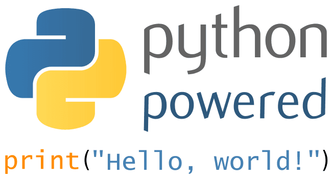
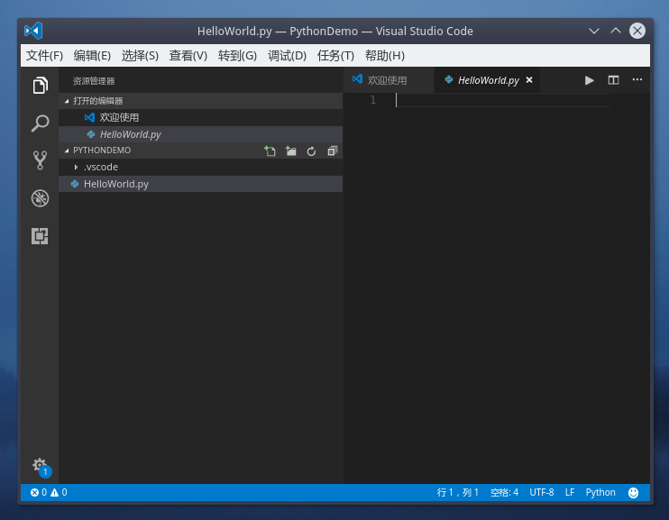
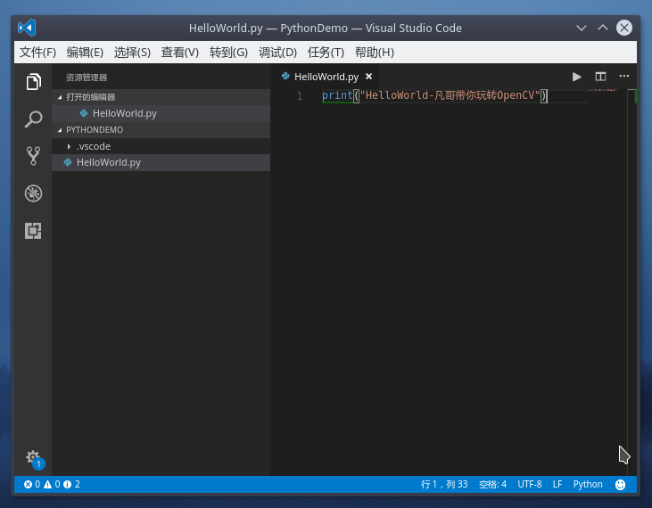

# 在Linux下运行你的第一个Python程序-1Z实验室


## 0. 概要

本期将会带你在linux的开发环境中创建你的第一个`python`程序, `HelloWorld`,并在终端中运行它.
在这个过程中, 会展示两种方法, 一种是命令行下的.
同时我们还会回顾之前学到过的几个命令行．





## 1. 创建一个py文件

我们首先打开一个`Terminal`, 你可以在桌面点击`Terminal`的图标，也可以使用快捷键`CTRL + ALT + T`打开．
我们当前在终端中进入到了用户主目录里. 一般来讲，我们直接把代码创建在用户主目录里是一种不太规范的做法．
所以我们需要在用户主目录的`Documents`文件夹中, 创建一个工程目录(文件夹)叫`PythonDemo`.

然后我们创建一个名字叫做`HelloWorld.py`的文件.


```bash
# 进入到Documents文件夹
scorpion@tl ~> cd Documents/
# 创建我们的工程目录 PythonDemo 用于存放我们的.py文件
scorpion@tl ~/Documents> mkdir PythonDemo
# 进入工程目录
scorpion@tl ~/Documents> cd PythonDemo/
# 使用touch指令, 创建一个后缀为.py的文件, 我们这里命名为HelloWorld
scorpion@tl ~/D/PythonDemo> touch HelloWorld.py
# 查看当前的路径
scorpion@tl ~/D/PythonDemo> pwd
/home/scorpion/Documents/PythonDemo
# 查看当前路径中的文件
scorpion@tl ~/D/PythonDemo> ls
HelloWorld.py
```


## 2. 编辑.py文件中的内容

这个时候我们需要使用代码编辑器/文本编辑器去编辑文件的内容.
指令取决于你操作系统上预装的文本编辑器软件.

在`XCore`里面配置了两个`gedit`跟`vscode`.

他们的指令分别是

**gedit**
```bash
gedit HelloWorld.py
```

**vscode**

```bash
# 编辑单个文件
code HelloWorld.py
# 或打开整个工程目录
code .
```




## 3. 编写Python代码

我们在代码编辑器中, 编辑对应的代码.

Python的`HelloWorld`代码只有一行.

```python
print("Akai: HelloWorld!!!")
```




保存文件.


## 4. 运行python程序

我们打开`Terminal`, 执行Python3的运行指令.


这里需要提的一点是, linux系统中,一般同时会具有`python3`跟`python2`两个版本.
执行`python`的时候, 默认会执行`python2`的程序. 

例如这样
```bash
scorpion@tl ~/D/PythonDemo> python
Python 2.7.13 (default, Jul 21 2017, 03:24:34) 
[GCC 7.1.1 20170630] on linux2
Type "help", "copyright", "credits" or "license" for more information.
>>> 
```
输入`exit()`退出.

我们也可以在终端中输入`python`然后按`Tab`键,可以看到所有python开头的可执行指令.

```bash
scorpion@tl ~/D/PythonDemo> python manage.py runserver
python                                           (Executable link, 10kB)
python-argcomplete-check-easy-install-script         (Executable, 2.5kB)
python-argcomplete-tcsh                               (Executable, 314B)
python-config                                   (Executable link, 3.1kB)
python2    (An interpreted, interactive, object-oriented programming...)
python2-config                                  (Executable link, 1.6kB)
python2.7  (An interpreted, interactive, object-oriented programming...)
python2.7-config                                     (Executable, 1.6kB)
python3    (An interpreted, interactive, object-oriented programming...)
python3-config                                  (Executable link, 3.1kB)
python3.6  (An interpreted, interactive, object-oriented programming...)
python3.6-config                                (Executable link, 3.1kB)
python3.6m                                            (Executable, 10kB)
python3.6m-config                                    (Executable, 3.1kB)
```
可以看到,的操作系统中, 内置了`python2.7`与`python3.6`两个版本的python解释器


在整套教程里采用的都是`Python3`.
所以我们每次执行`python`的代码的时候, 都要以
```bash
python3 + 代码(.py文件)
```
的方式去运行.


```bash
scorpion@tl ~/D/PythonDemo> python3 HelloWorld.py 
Akai: HelloWorld!!!
```


如果你想了解`Python3`与`Python2`的区别, 可以参考下列文章.

* [Python 2.7.x 与 Python 3.x 的主要差异](https://chenqx.github.io/2014/11/10/Key-differences-between-Python-2-7-x-and-Python-3-x/)
* [知乎-Python 2 和 Python 3 有哪些主要区别？](https://www.zhihu.com/question/19698598)


## 5. 的教学小结

带大家在linux的开发环境中, 通过命令行的方式创建你的第一`python`程序.
主要目的是为了帮大家回顾之前学到过的几个命令行, 当然你也可以打开`vscode`或其他代码编辑器, 用图形化的方式, 打开工程目录创建一个.py文件.
同时建议大家, 我们的工程代码, 最好要放在`Documents`下面.

接下来给大家介绍了linux下的python解释器是分`python2`, `python3`两种的.
我们执行python3的程序的时候需要使用
```bash
python3 + .py文件名/路径
```
然后我们顺利执行了.py文件, 在终端打印出来对世界的问候.

