## 概览

本文旨在让你对 Ubuntu 的常规操作快速上手，以便适应小车教程中 Ubuntu 上的 Python 环境使用

#### 本文路线：

📗 [安装 Ubuntu](#Ubuntu安装)

📗 [终端常见说明](#默认情况下terminal中常见符号和常见快捷键)

📗 [软件源是什么](#源)

📗 [怎么安装软件](#软件安装)

#### 反馈or求助

📕 或许写的不尽你意，如果你有什么问题或是什么建议，可以 Email to: lingxing1017@gmail.com 或者[使用 anydesk 请求协助](../00anydesk协助.md)，我们一起探索前行


## Ubuntu安装

无论下面哪一种你都需要先[下载](https://www.ubuntu.com/download/alternative-downloads)一个 iso 镜像。

* 推荐新手尝试：虚拟机安装 Ubuntu
    1. [VMware 虚拟机](https://blog.csdn.net/colin_lisicong/article/details/70193539)
    2. [VirtualBox 虚拟机](https://jingyan.baidu.com/article/e52e36157a8cc740c60c51ee.html)

* [U 盘安装 Ubuntu](https://www.jianshu.com/p/16b36b912b02)

* 不推荐：Windows10 Linux子系统

更多关于安装的信息可以参见：[Ubuntu 下载页第二部分—— Easy ways to switch to Ubuntu](https://www.ubuntu.com/download/desktop)
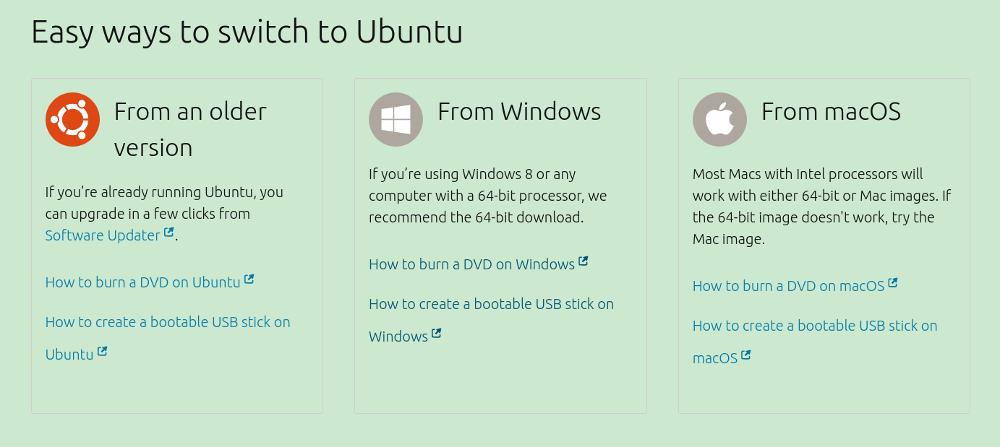


## 默认情况下terminal中常见符号和常见快捷键

* 常见符号
    1. \#：root（管理员）用户显示 `#`

        

    2. $：非root（管理员）用户的符号会显示 `$`

        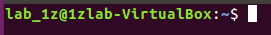

    3. ～：代表 /home/当前用户的家目录

        /home 类比到 Windows 下就是

        `pwd` 是 `print working directory` 的缩写，即打印工作目录，在命令行中键入此命令不加任何参数默认打印当前终端所在目录，下图就是打印了 `~` 所代表的目录

        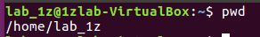

* 常见快捷键
    1. 复制/粘贴：`Ctrl+Shift+C` / `Ctrl+Shift+V`
    2. 自动补全：`Tab`（你可以试下双击Tab，看看有什么效果）
    3. 打开终端快捷键：`Ctrl+Alt+T`


## 源

软件源在 Ubuntu 下就是一个应用程序安装库，很多很多的应用软件都在这个库里面，它可以是网络服务器、光盘，或者是硬盘上的一个目录。

通过软件源安装软件的原理非常简单，Ubuntu 系统中自带了一个名为 apt 的软件包管理工具，它的主要功能就是负责 Ubuntu 系统中所有软件包的管理，包括从软件源中下载软件，卸载系统中已经安装的软件等。当我们通过 `sudo apt install package-name` 命令去安装一个软件时，apt 包管理工具就会从系统中一个叫做源列表的文件中去读取软件源的网址信息，查找可以包含该软件的软件源的网址，然后就从这个网址上把指定的软件给下载下来，然后由 apt 包管理工具在本地进行一些解压和安装的其他操作。

在 Ubuntu 中软件源其实还细分为下面两种：
* Ubuntu 官方软件源
    Ubuntu 官方软件源中包含了 Ubuntu 系统中所用到的绝大部分的软件，它对应的源列表是 `/etc/apt/sources.list`，so 如果你觉得更新软件比较慢的话就要从这个文件入手了，你可以从 [Ubuntu 源列表](http://wiki.ubuntu.org.cn/%E6%BA%90%E5%88%97%E8%A1%A8)选择国内的一些镜像软件源加快访问速度。

    Example：换成浙江大学的镜像软件源
    1. 进入[浙江大学的镜像站点](http://mirrors.zju.edu.cn/)
    2. 配置生成器生成量身定制的配置说明和配置文件

        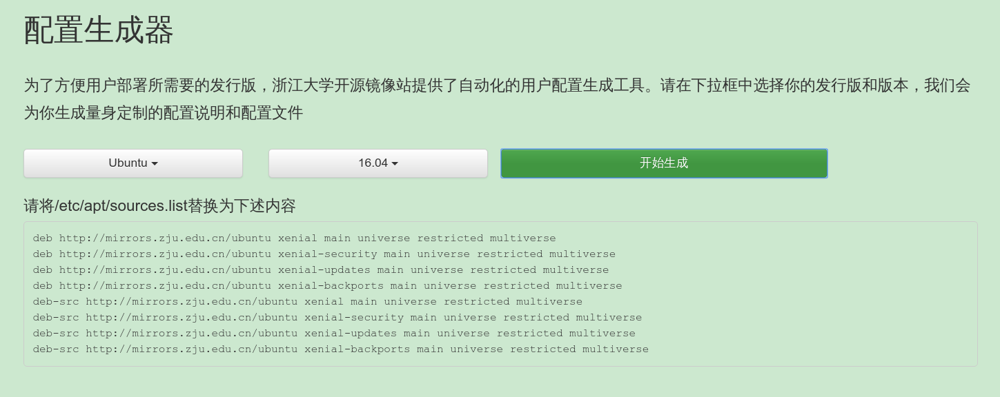

    3. 为了养成备份的好习惯，我们得先备份 /etc/apt/sources.list

        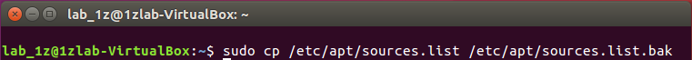

        `.bak`后缀可以由你自己决定，这里选用这个后缀只是一个习惯

    4. 将 /etc/apt/sources.list 替换为第二步生成内容

        用gedit打开sources.list

        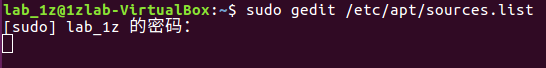

        当你在终端键入上图中的命令以后就会弹出类似下图的窗口（Windows记事本怎么操作，它就可以怎么操作）

        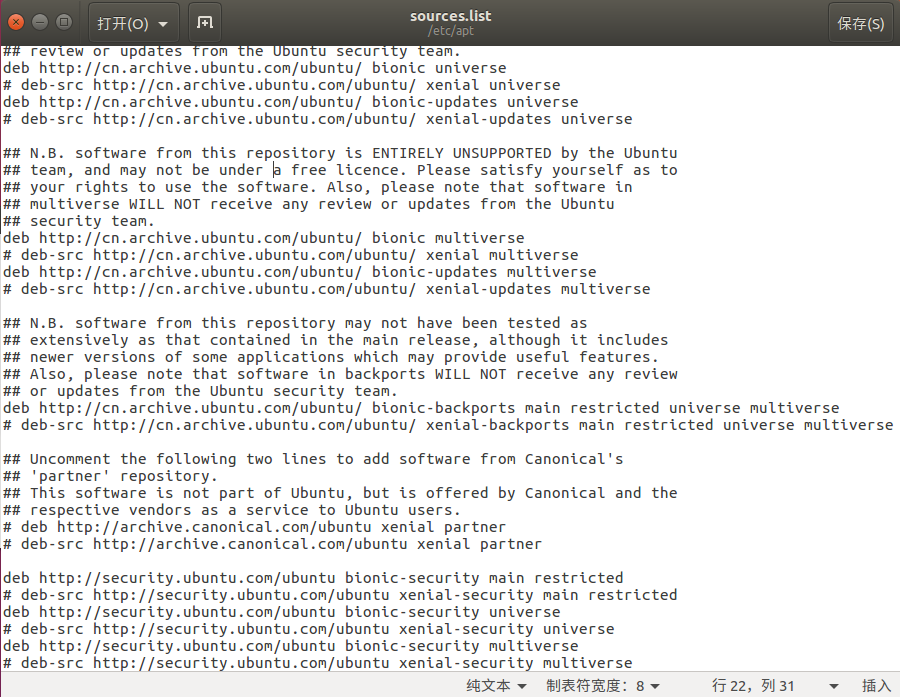

        在这个窗口中删除之前的内容，粘贴第二步生成的内容，保存即可。当你粘贴完没有保存的时候，文件名左上角会有一个 `*` 示意。关于保存方式，前面提到了它相当于 Windows 的记事本，所以 `Ctrl+S` 可以保存，直接点击右上角保存也OK，此外，直接点左上角 `X` 也会提示保存。保存完后点左上角 `X` 直接关闭窗口即可。

        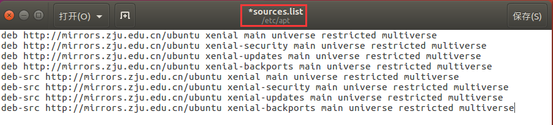

    5. 执行下述命令更新本地软件版本
        ```bash
        sudo apt update && sudo apt upgrade
        ```

* PPA 软件源
    这个后续用到再介绍。

更多关于源的信息可以参见：[详解 Ubuntu 软件源](https://www.jianshu.com/p/57a91bc0c594)


## 软件安装

* 软件源内存在的软件安装

    Example：安装新立德包管理器
    1. 搜索新立德包管理器是否在当前配置的软件源中存在

        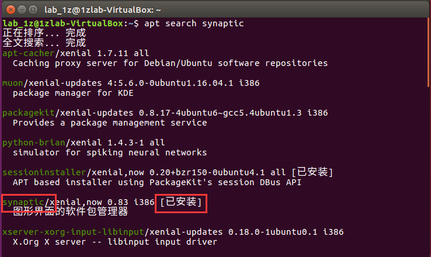

        如果你已经安装了，那么这个搜索结果中这个软件包的最后会标注`[已安装]`

    2. 如果有，准备安装
        ```bash
        $ sudo apt install synaptic #此时synaptic应该和上一步中查询的名字一致
        ```

* 图形化工具安装软件

    Ubuntu 自带的或者 Synaptic（新立得）包管理器

* deb包安装

    Example：安装 wps
    1. 下载 [wps](http://www.wps.cn/product/wpslinux/) 的deb包
    2. 打开 terminal
        ```bash
        $ cd ~/Downloads #进入deb包下载目录
        sudo dpkg -i wps-office_10.1.0.6757_amd64.deb #dpkg安装
        ```

* 源码编译安装

    这个等后续展开讲，初期能不自行编译就不自行编译

#### 关于windows上一些常用软件的说明

* 腾讯家族、百度网盘之类的一律没有官方开发的 Linux 版
* 音乐软件有一个[网易云音乐 Linux 版](https://music.163.com/#/download)
* 文档处理可以用 [wps Linux 版](http://www.wps.cn/product/wpslinux/)
* 本地的文本编辑器可以用自带的 gedit（比较像 Windows 上的记事本，操作也比较接近，推荐用）、nano
* 简单介绍 下Synaptic（新立得）包管理器，它就像是 Windows 上各类软件管家一样，只是界面丑点（当然既然使用的是 Ubuntu，在你习惯命令之后还是以回归命令行操作为主）
    当你安装完打开它的时候会让你输入密码

    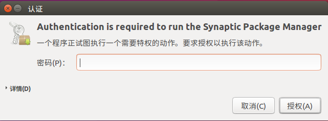

    这个地方或许会有一个小坑，如果你实际遇到了可以自己思考下，或者问我。授权以后就可以看到如下界面了

    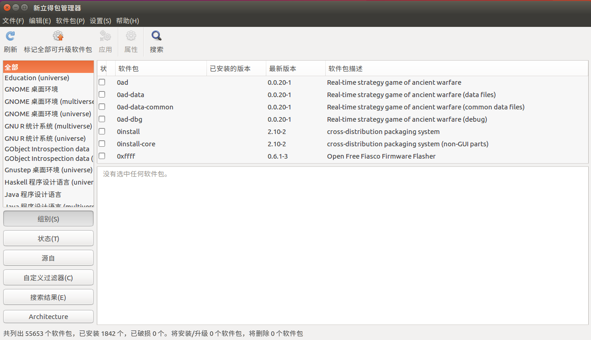

    然后你就可以通过搜索自己想要的软件包进行安装了。
