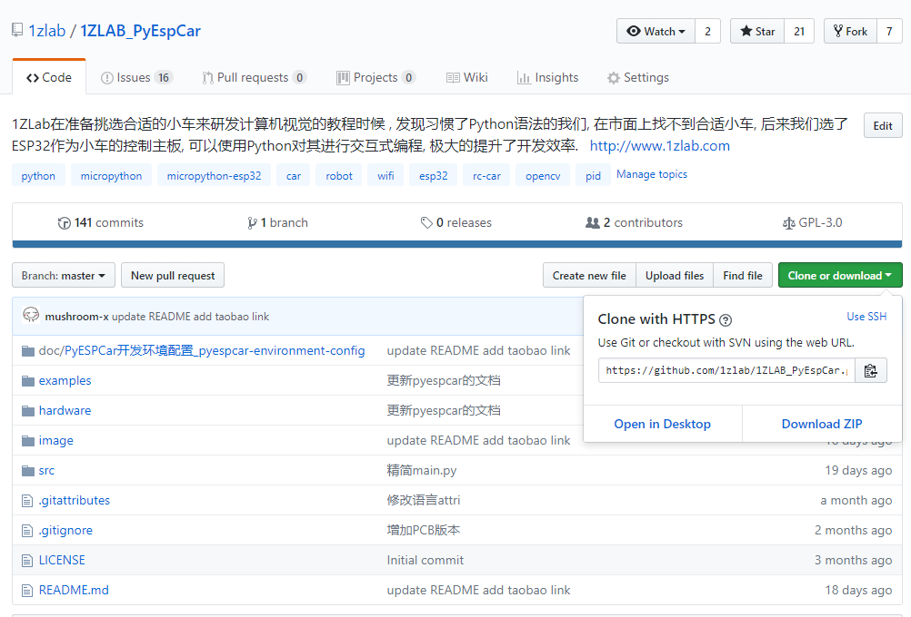
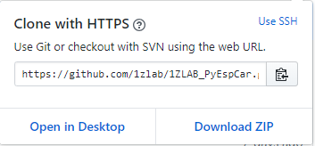
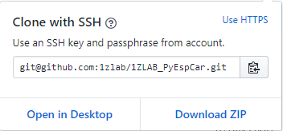
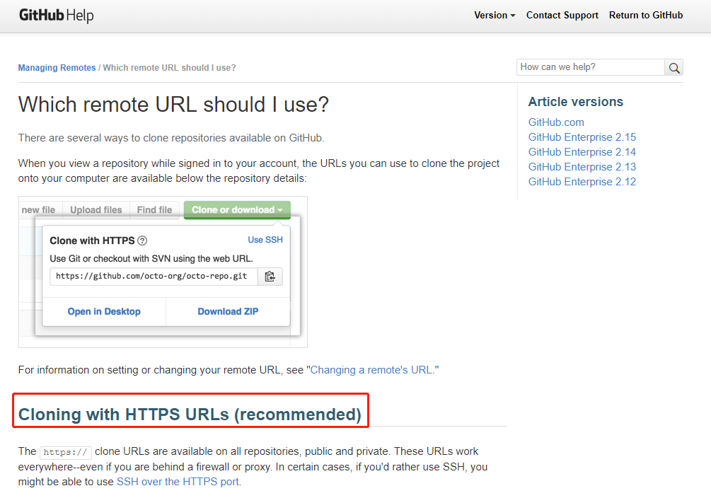
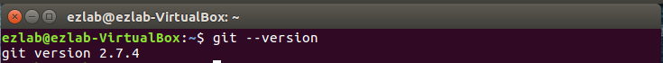
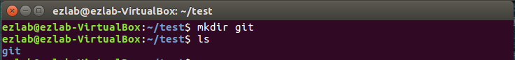
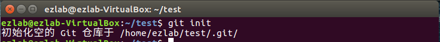
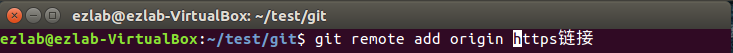

## 概览

本文打算让你在几分钟内就掌握常见的 git 操作

#### 本文路线：

📗 [clone 大法好](#clone大法好)

📗 [创建本地仓库](#创建本地仓库)

📗 [关联远程仓库](#关联远程仓库)

📗 [一推一拉](#一推一拉)

📗 [Git 介绍](#Git介绍) 👈🏼 如果你想先了解下什么是 git

#### 反馈or求助

📕 或许写的不尽你意，如果你有什么问题或是什么建议，可以 Email to: lingxing1017@gmail.com 或者[使用 anydesk 请求协助](../00anydesk协助.md)，我们一起探索前行


## clone大法好

当我们打开 PyESPCar github 的大门以后，我们会做的第一个操作就是 clone 一份到本地，当然你可以选择 Download ZIP 通过下载 zip 压缩包的方式将 PyESPCar 下载到本地，但是作为已经在 Ubuntu 上作妖的我们来说，这太 low 了



所以我们在终端中输入下面的命令将 PyESPCar 克隆到本地
```bash
$ git clone https://github.com/1zlab/1ZLAB_PyEspCar.git
```

那么问题来了，clone 后面的 https 地址是哪儿来的呢？

这话还得从当你在某个仓库点击 `Clone or download` 之后说起，当你点击之后会发现有个提示框，而框中默认显示的链接是下图这个样子的



然后又有一个问题出现了，上图中的 `Use SSH` 是啥，点了以后会咋样？

当你点了 `Use SSH` 以后，提示框会变成楼下这样，那链接也是可以用于 clone 的。别问我怎么把提示框切回去，聪明的你怎么可能不知道



那为啥我们 clone 后面的链接选择的是 https 的不选点了 `Use SSH` 的那个链接呢？

这个问题就说来话长了，但是我选择长话短说，其实就是两个关键点，一是麻烦，二是没权限。如上图所圈，SSH 链接需要部署 SSH 密钥，更关键的一点是，你必须是这个仓库的管理员或者拥有者，显然你不是，因为这仓库是凯哥的，哈哈哈。所以，听话，clone 别人的仓库要用 https 链接，不要再想着 SSH 链接了，而且 [gitub 官方帮助文档](https://help.github.com/articles/which-remote-url-should-i-use/)上也推荐使用 https 链接。



什么？你说你不信？那我帮你试试好了


## 创建本地仓库

既然已经看到了 git 这只小妖精，那不能降服她岂不是亏了。

* 首先确认本机装了 git，如果没装，[温故而知新](./01Ubuntu从安装到作孽.md#软件安装)去

    
* 创建目录——你希望仓库放在哪儿就创建在哪儿，我创建在 ~/test/git/

    
* 初始化仓库

    
* 骚操作之上面两步合成一步

    

关于`.git` 目录的简单说明：你可以把它当成是考试成绩单，考完试有个分数，老师给你把成绩都留着，一直保存着，除非教学楼被烧了，所以除非你把它删了，不然你的修改记录它都给你保存着。

## 关联远程仓库

如果你也想在 github 上装一波 13，那就要学会关联远程仓库了

* 在 github 上创建一个仓库，这我就不上图了，首先你得有个账号，登陆 github 以后你可以在头像左边看到一个➕，说时迟那时快，别犹豫，点它，然后就可以看到一个提示框，里面有个选项叫 `New repository`，点它，接下来的就看你的造化了
* 把本地仓库和远程仓库做关联，切记，你得在本地仓库目录中，不然命令就没效果了

    
* 骚操作之问：这个 origin 是什么呢？
    是你给远程仓库取的代号，所以你能想到什么呢？
* 查看关联的远程仓库
    ```bash
    $ git remote -v
    ```

问题又找上门了，本地仓库的名字、远程仓库的名字、远程仓库的代号，这仨分别是啥关系呢？

举个栗子，你在家的时候爸妈叫你小名，在公司或者学校的时候同事或者同学叫你全名，在网上的时候别人叫你网名，这三个名字完全没关系，指向的人都是你。所以你想怎么取名都可以，三个名字都一样，可以，三个名字都不一样，可以，其中两个一样，可以。


## 一放一推一拉

* 修改放入本地仓库
    1. add 文件
        ```bash
        $ git add 文件名
        ```
    2. commit -m "修改说明"
        ```bash
        $ git commit -m "修改说明"
        ```
* 推送修改
    ```bash
    $ git push origin master
    ```
* 拉取修改
    ```bash
    $ git pull
    ```


## Git介绍

[回到概览](#概览)

*  大家好，我叫狗子，是一名大四毕业生，现在是 2018 年 6 月 1 日凌晨 2 点，我正在奋斗我的毕业论文，前晚我熬尽心血写完了初稿，兴冲冲的发给了我亲爱的导师，没想到，他说他前段时间忙，忘记把论文大纲发给我了，留下我在黑夜里凌乱。【初稿】

    现在是 2018 年 6 月 1 日 12 点，我又通了个宵，按大纲把我的初稿删删改改填了进入，又发给了我亲爱的导师。【修改 1】

    现在是 2018 年 6 月 1 日晚 10 点，导师又把我的论文打回来了，并且要我把初稿中删除的某些语句加回来，看着他的批注，我有点迷茫，于是我把同组的小伙伴的叫来帮我，我们开始了一起工作的欢快夜晚。【修改 2_我】【修改 2_他】
    然后我发现了一个问题，我们改的地方不完全一样，甚至没法简单的复制粘贴合并成一篇论文，于是我只好一个人把他的成果和我的一点一点比对合并。

    现在是 2018 年 6 月 2 日 10 点，我终于合并完了，他却告诉我他又更新了一些东西，要我再合并一下，然后我就晕倒了。梦里上帝对我说了一句话（我们都知道上帝是歪果仁，所以）“git, you need version control.”
* **git**
    是一个开源的分布式版本控制系统，可以有效、高速的处理从很小到非常大的项目版本管理。Git 是 Linus Torvalds 为了帮助管理 Linux 内核开发而开发的一个开放源码的版本控制软件。
* **历史：** 
    自2002年开始，林纳斯·托瓦兹决定使用 BitKeeper 作为 Linux 内核主要的版本控制系统用以维护代码。因为 BitKeeper 为专有软件，这个决定在社群中长期遭受质疑。在 Linux 社群中，特别是理查德·斯托曼与自由软件基金会的成员，主张应该使用开放源代码的软件来作为 Linux 核心的版本控制系统。

    2005年，安德鲁·垂鸠写了一个简单程序，可以连接 BitKeeper 的存储库，BitKeeper 著作权拥有者拉里·麦沃伊认为安德鲁·垂鸠对 BitKeeper 内部使用的协议进行逆向工程，决定收回无偿使用 BitKeeper 的许可。Linux 内核开发团队与 BitMover 公司进行磋商，但无法解决他们之间的歧见。林纳斯·托瓦兹决定自行开发版本控制系统替代 BitKeeper，以十天的时间，编写出第一个 git 版本。
