## 概览

本文旨在解决本小僵尸给出的虚拟机导入包存储空间太小的问题

#### 本文路线：

📗 [各种说明](#各种说明)

📗 [一起扩容吧](#撑大它的肚量)

📗 [残留的疑问](#残留的疑问)

#### 反馈or求助

📕 或许写的不尽你意，如果你有什么问题或是什么建议，可以 Email to: lingxing1017@gmail.com 或者[使用 anydesk 请求协助](../00anydesk协助.md)，我们一起探索前行


## 各种说明

1. 本小僵尸给出的导入包是适用 VirtualBox 虚拟机的，也就是说你的虚拟机得是 VirtualBox 的

2. 说了那么多包在哪呢？
    [在这](https://pan.baidu.com/s/1rnh0_wapBRlrWWbxL15kTw)，提取密码：ckhf

3. 有啥不一样？
    * 这是为 `1Z Lab` 官网的学习教程定制的 Ubuntu16.04 环境，通过 VirtualBox 导入即可打开学习的大门
    * 预装 Pycharm（IDE）、 VsCode（编辑器）和教程中的一大部分 Python 环境
    * Ubuntu 的分区方案选择了推荐默认方案，一个根分区，一个交换分区

4. 遇到了啥问题呢？一个非常严重的问题，那就是我设置了 Ubuntu 的存储空间为 VirtualBox 提供的默认值 10G，这就导致了如果你安装更多的环境或者尝试更多的软件，可能会提示存储空间不足的问题
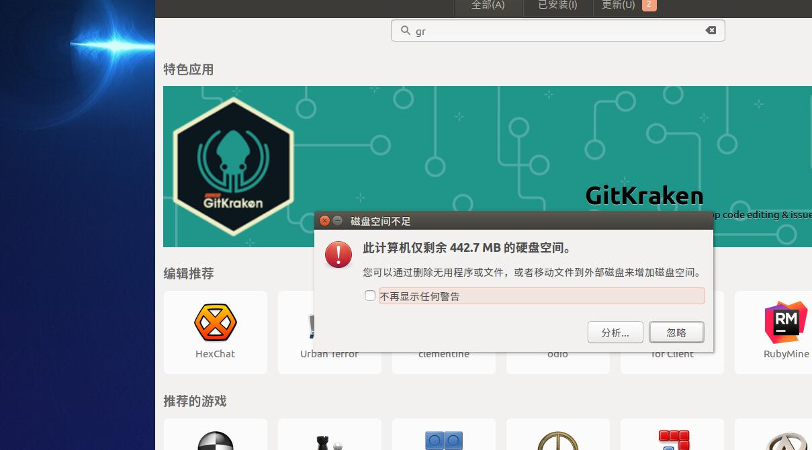


## 撑大它的肚量

1. 转换 VirtualBox 虚拟磁盘的格式
    * 选中对应虚拟机，点`设置`，`存储`菜单下右键`位置`，可以直接复制路径，找到虚拟磁盘所在位置
    
    * 打开路径，如果文件夹下的虚拟磁盘是vdi这个后缀的，那么恭喜你，你可以跳过转换虚拟磁盘格式这一步了
    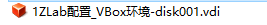
    正常导入本小僵尸虚拟机的童鞋，你们的虚拟磁盘是下图这样婶的，这时候你就只能委曲求全转换下格式了，毕竟这个格式 VBox 是没法直接扩容的（当然你可以用 VMWare 虚拟机进行扩容，这个以后再讲）
    
    * 开始转换吧，这步需要一丢丢时间和耐心
        ```bat
        "VirtualBox安装目录\VBoxManage.exe" clonehd "虚拟磁盘目录\虚拟磁盘名.vmdk" "虚拟磁盘目录\虚拟磁盘名.vdi" --format vdi
        ```
        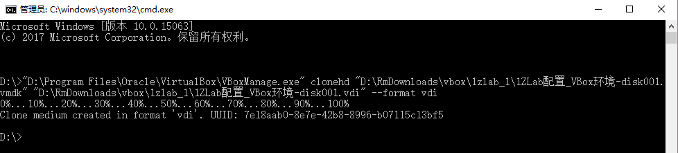
        等进度到 100%，你就会发现文件夹下成了这个样子，这时候你就可以安心的把 `vmdk` 后缀的磁盘删除了
        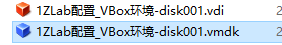

2. 扩容在此一举
    ```bat
    "VirtualBox安装目录\VBoxManage.exe" modifyhd "虚拟磁盘目录\虚拟磁盘名.vdi" "虚拟磁盘目录\虚拟磁盘名.vdi" --resize 20480
    ```
    `20480` 是调整后的大小，这里相当于 20G，效果如图，
    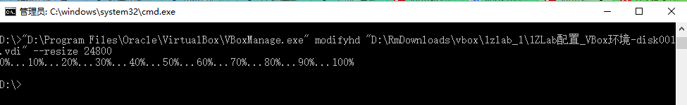
    注：图里手滑写错了，所以大小变成 24G+ 了

3. 更换 VirtualBox 下对应虚拟机的虚拟磁盘
    * 打开对应虚拟机设置，`存储`菜单下
    * 选中 vmdk 虚拟磁盘，删除
    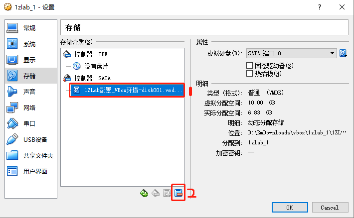
    * 添加 vdi 虚拟磁盘，使用现用的虚拟盘
    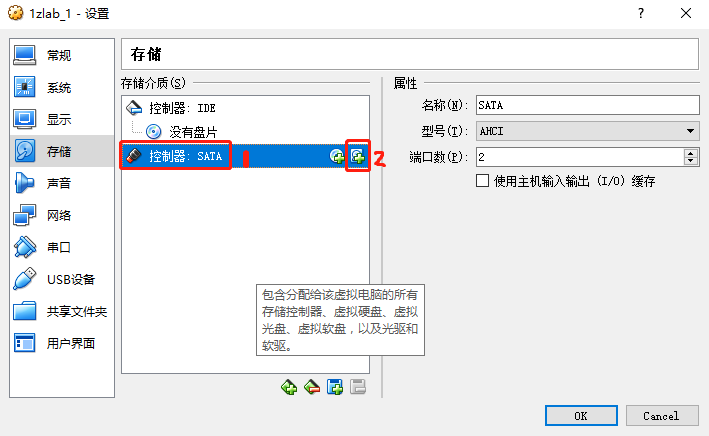
    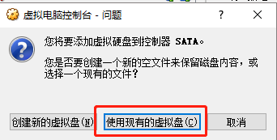
    * 点击 OK 保存修改

4. 磁盘空间大了，但事实上多出来的空间还没有归 Ubuntu 使用，开机还是会遇见之前那个错误提示，因为你还需要下面的操作
    * 安装一个 gparted，你可以选择用 Ubuntu 软件，也可以用 apt 安装，推荐使用后者
    * 从终端打开 gparted
    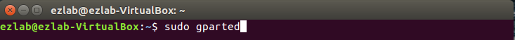
    原来扩容的部分还是未分配状态
    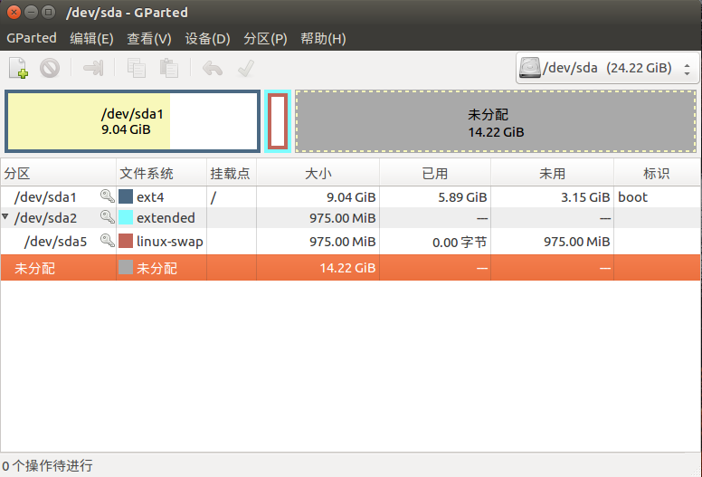
    * 关闭 swap
    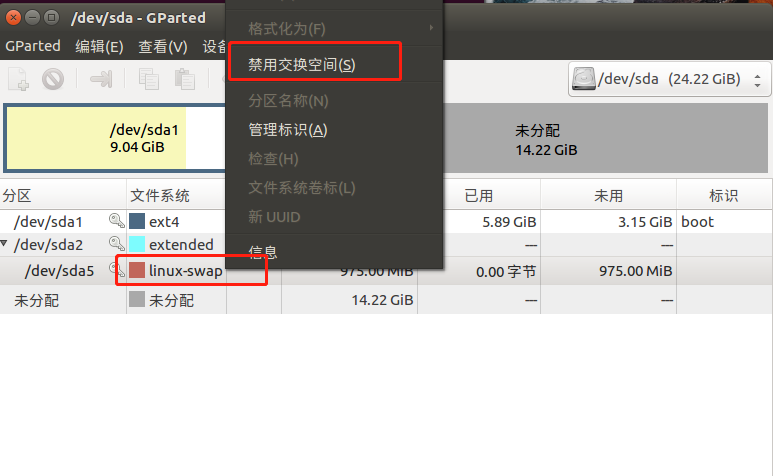
    * 删除 swap 分区
    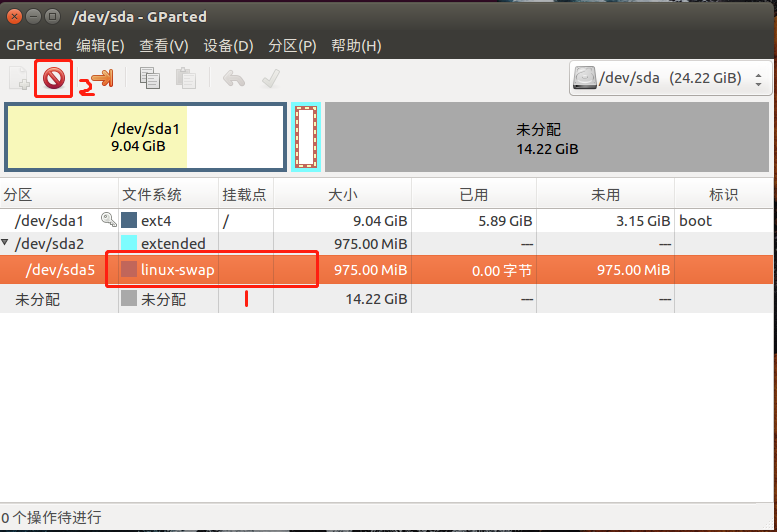
    同样的手法，删除 extended 分区
    * 放大 `/` 分区
    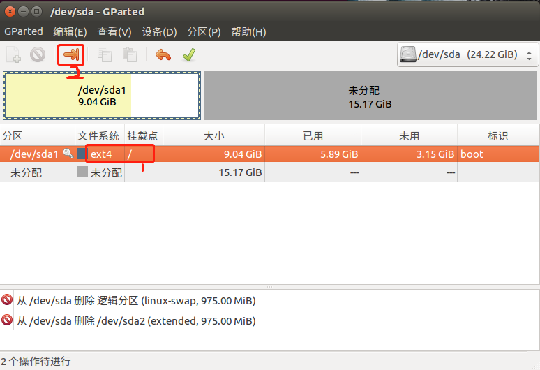
    可以直接用红框 1 拖动，也可以用红框 2 手动修改
    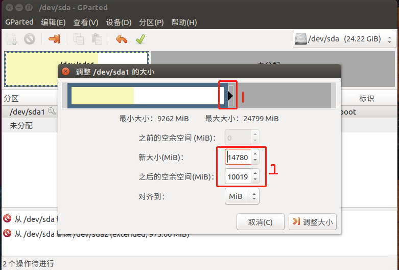
    最后点下`调整大小`
    * 最后的最后，保存变更
    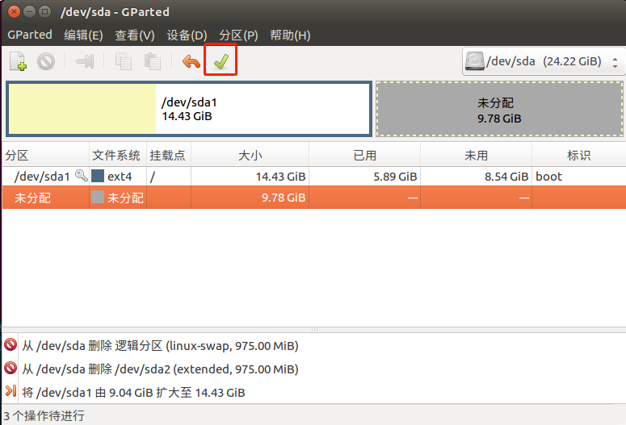
    等它提示完成，就结束了这一场战争
    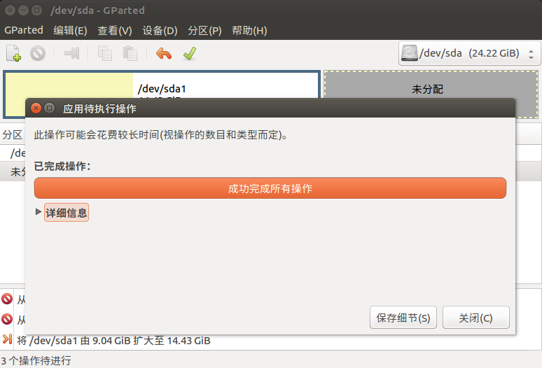


## 残留的疑问

1. swap 分区是什么？
2. swap 分区就这样删除了没问题吗？

勤快的你可以搜索下答案，如果你觉得搜索的大信息量让你一头雾水，那就敬请关注 `Hello Ubuntu` 了