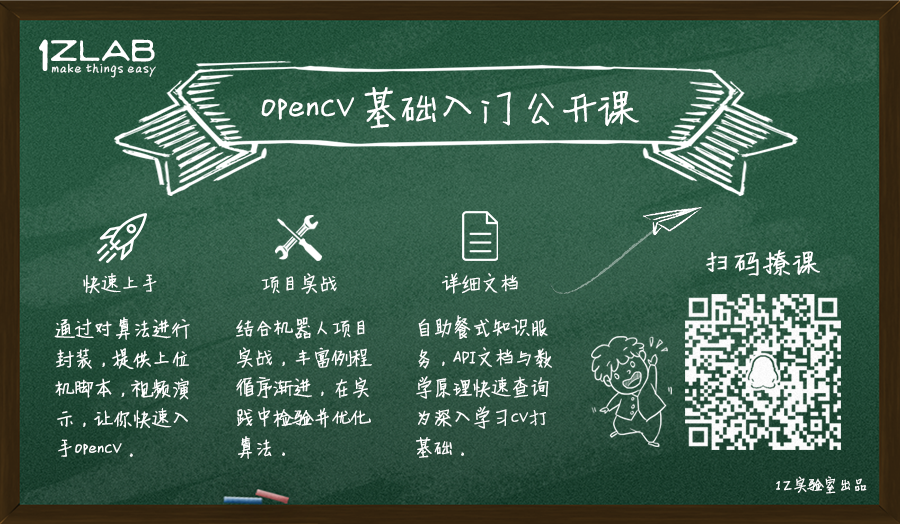

# Ubuntu快速入门-1Z实验室

**1Z实验室： Make Things Easy**

## 导言

💡 想让你看完就会

📖 初步安排，前两篇为了满足那些希望尽快进入esp32学习的筒子，所以会将重点放在上手Ubuntu基础操作以及Python环境相关问题

#### 反馈or求助

📕 或许写的不尽你意，如果你有什么问题或是什么建议，可以email to lingxing1017@gmail.com或者[使用anydesk请求协助](./00anydesk协助.md)，我们一起探索前行

## 目录

* [Ubuntu从安装到作孽](./01Ubuntu从安装到作孽.md)

## 此外

* [为什么要学习命令行](/01.为什么要学习命令行/为什么要学习命令行.md)
* [初识终端](/02.初识终端/初识终端.md)
* [文件系统之文件操作01](/03.文件系统之文件操作01/文件系统之文件操作01.md)
* [文件系统之文件操作02](/04.文件系统之文件操作02/文件系统之文件操作02.md)
* [如何查询指令的使用手册](/05.如何查询指令的使用手册/如何查询指令的使用手册.md)
* [在Linux下运行你的第一个Python程序](/06.在Linux下运行你的第一个Python程序/在Linux下运行你的第一个Python程序.md)

## 加入1Z实验室

